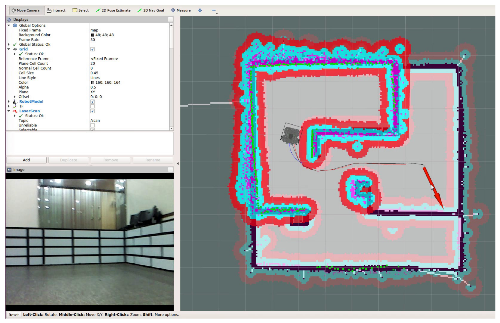

# **Ubuntu install of ROS Noetic**

> NOTE: This instruction focuses on the perfomance installation and running commands. For more detail, you can read pdf book [ROS Robot Programming (35.6 MB)](https://www.robotis.com/service/download.php?no=719) and go to [ROS Official Tutorials](https://wiki.ros.org/ROS/Tutorials).

 

### Previous: [11. Build System #4: Build the System](11-Build-System-(4)-Build-the-System.md)

 

# 13. ROS Tools #1: 3D Visualization Tool (RViz)

RViz 1 is the 3D visualization tool of ROS. The main purpose is to show ROS messages in 3D, allowing us to visually verify data. For example, it can visualize the distance from the sensor of a Laser Distance Sensor (LDS) to an obstacle, the Point Cloud Data (PCD) of the 3D distance sensor such as RealSense, Kinect, or Xtion, the image value obtained from a camera, and many more without having to separately develop the software.

Loading screen of RViz, the 3D visualization tool of ROS:

RViz example 1: Navigation using TurtleBot3 and LDS sensor

RViz example 2: Obtain the skeleton of a person using Kinect and Command with a Motion

RViz example 3: Measuring distance using LDS

RViz example 4: distance, infrared, color image value obtained from Intel RealSense

## 1. Installing and Running RViz

If you have installed ROS with ‘ros-[ROS_DISTRO]-desktop-full’ command, RViz should be installed by default. If you did not install the ‘desktop-full’ version ROS or for some reason, RViz is not installed, use the following command to install RViz.

    sudo apt-get install ros-kinetic-rviz

The execution command of RViz is as follows. However, just as for any other ROS tool, roscore must be running. For your reference, you can also run it with the node running command ‘rosrun rviz rviz’.

    rviz

## 2. RViz Screen Components

**`(1)`** **3D View:** This black area is located in the middle of the screen. It is the main screen which allows us to see various data in 3D. Options such as background color of the 3D view, fixed frame, and grid can be configured in the Global Options and Grid settings on the left column of the screen.

**`(2)`** **Displays:** The Displays panel on the left column is for selecting the data that we want to display from the various topics. If we click `[Add]` button on the lower left corner of the panel, the display 4 selection screen will appear as shown in Figure 6-7. Currently, there are about 30 different types of displays we can choose from, which we will explore more in the following section.

**`(3)`** **Menu:** The Menu bar is located on the top of the screen. We can select commands to save or load the current display settings, and also can select various panels.

**`(4)`** **Tools:** Tools are located below the menu bar, where we can select buttons for various functions such as interact, camera movement, selection, camera focus change, distance measurement, 2D position estimation, 2D navigation target-point, publish point.

**`(5)`** **Views:** The Views panel configures the viewpoint of the 3D view.

- **Orbit:** The specified point is called the focus and the orbit rotates around this point. This is the default value and the most commonly used view.

- **FPS(first-person):** This displays in a first-person viewpoint.

- **ThirdPersonFollower:** This displays in a third-person viewpoint that follows a specific target.

- **TopDownOrtho:** This uses the Z-axis as the basis, and displays an orthographic projection of objects on the XY plane.

- XYOrbit: This is similar to the default setting which is the Orbit, but the focus is fixed on the XY plane, where the value of Z-axis coordinate is fixed to zero.

**`(6)`** **Time:** Time shows the current time (wall time), ROS Time, and the elapsed time for each of
them. This is mainly used in simulations, and if there is a need to restart it, simply click the
[Reset] button at the very bottom.

## 3. RViz Displays

The most frequently used menu when using RViz will probably be the Displays 5 menu. This
Displays menu is used to select the message to display on the 3D View panel, and descriptions on each item are explained as follow.

| Name      | Description |
| ----------- | ----------- |
| Axes    | Displays the xyz axes. |
| Axes    | This |
| Axes    | This |
| Axes    | This |
| Axes    | This |
| Axes    | This |
| Axes    | This |
| Axes    | This |
| Axes    | This |
| Axes    | This |
| Axes    | This |
| Axes    | This |
| Axes    | This |
| Axes    | This |
| Axes    | This |
| Axes    | This |
| Axes    | This |
| Axes    | This |
| Axes    | This |
| Axes    | This |
| Axes    | This |
| Axes    | This |
| Axes    | This |
| Axes    | This |
| Axes    | This |
| Axes    | This |
| Axes    | This |
| Axes    | This |