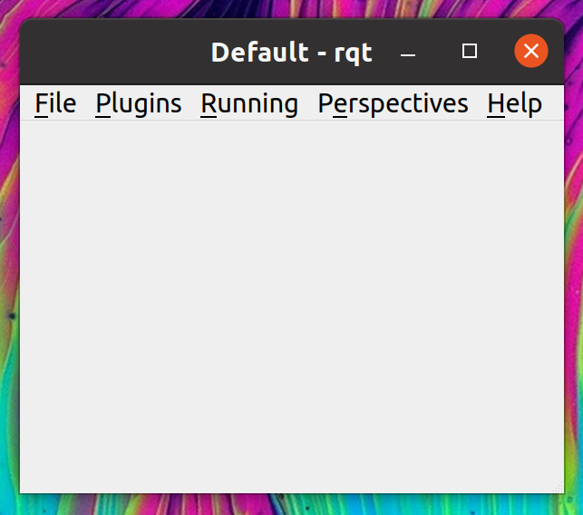
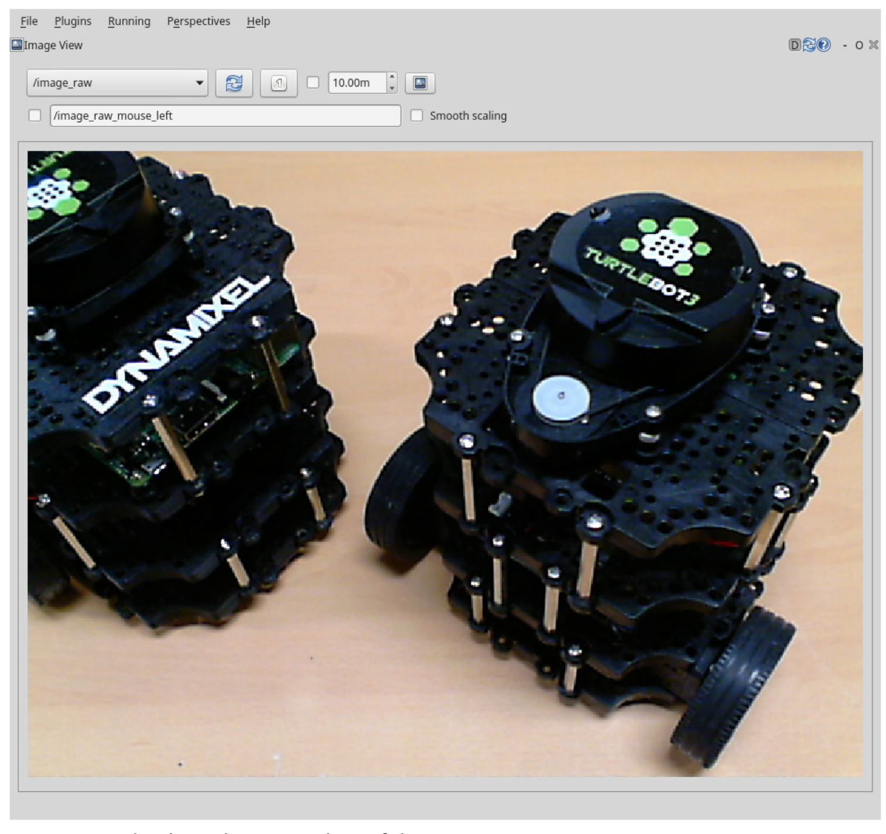

# **Ubuntu install of ROS Noetic**

> NOTE: This instruction focuses on the perfomance installation and running commands. For more detail, you can read pdf book [ROS Robot Programming (35.6 MB)](https://www.robotis.com/service/download.php?no=719) and go to [ROS Official Tutorials](https://wiki.ros.org/ROS/Tutorials).

 

### Previous: [13. ROS Tools #1: 3D Visualization Tool (RViz)](13-ROS-Tools-(1)-3D-Visualization-Tool-(RViz).md)

 

# 14. ROS Tools #2: ROS GUI Development Tool (rqt)

Besides the 3D visualization tool RViz, ROS provides various GUI tools for robot development. For example, there is a graphical tool that shows the hierarchy of each node as a diagram thereby showing the status of the current node and topic, and a plot tool that schematizes a message as a 2D graph. Starting from the ROS Fuerte version, more than 30 GUI development tools have been integrated as the tool called rqt 6 which can be used as a comprehensive GUI tool. Furthermore, RViz has also been integrated as a plugin of rqt, making rqt an essential GUI tool for ROS.

## 1. Installing and Running rqt

If you have installed ROS with ‘ros-[ROS_DISTRO]-desktop-full’ command rqt will be installed by default. If you did not install the ‘desktop-full’ version ROS or for some reason, ‘rqt’ is not installed, then the following command will install ‘rqt’.

    sudo apt-get install ros-noetic-rqt*

The command to run rqt is as follows. You can simply type in ‘rqt’ on the terminal. For your reference, we can also run it with the node execution command ‘rosrun rqt_gui rqt_gui’.

    rqt

If we run ‘rqt’ then the GUI screen of rqt will appear as shown below. If it is the first time being launched, it will display only the menu without any content below. This is because the plugin, which is the program that is directly run by ‘rqt’, has not been specified.

The rqt menus are as follows.

- **Files:** The File menu only contains the sub-menu to close ‘rqt’.

- **Plugins:** There are over 30 plugins. Select the plugin to use.

- **Running:** The currently running plugins are shown and they can be stopped when
they are not needed.

- **Perspectives:** This menu saves operating plugins as a set and uses them later to run the same plugins.

## 2. rqt Plugins

From the ‘rqt’ menu on the top, if we select [Plugins] we can see about 30 plugins. These plugins have the following roles. Most of them are default plugins of ‘rqt’ that have very useful features. Unofficial plugins can also be added, and if necessary, we can add custom ‘rqt’ plugins that we developed for ourselves as well.

### Action

- Action Type Browser: This is a plugin to check the data structure of an action type.

### Configuration

- Dynamic Reconfigure: This is a plugin to modify the parameter value of a node.

- Launch This is a GUI plugin of roslaunch, which is useful when we cannot remember the
name or composition of roslaunch.

### Introspection

- Node Graph: This is a plugin for the graphical view that allows us to check the relationship diagram of the currently running nodes or message flows.

- Package Graph: This is a plugin for the graphical view that displays the dependencies of the packages.

- Process Monitor: We can check the PID (Processor ID), CPU usage, memory usage, and
number of threads of the currently running nodes.

### Logging

- Bag: This is a plugin regarding the ROS data logging.

- Console: This is a plugin to check the warning and error messages occurring in the nodes in one screen.

- Logger Level: This is a tool to select a logger, which is responsible for publishing the logs, and set the logger level to publish a specific log such as ‘Debug’, ‘Info’, ‘Warn’, ‘Error’, and ‘Fatal’. It is very convenient if ‘Debug’ is selected while debugging process.

### Miscellaneous Tools

- Python Console: This is a plugin for the Python console screen.

- Shell: This is a plugin that launches a shell.

- Web: This is a plugin that launches a web browser.

### Robot Tools

- Controller Manager: This is a plugin to check the status, type, hardware interface
information of the robot controller.

- Diagnostic Viewer: This is a plugin to check the robot status and error.

- Moveit! Monitor: This is a plugin to check the MoveIt! data that is used for motion planning.

- Robot Steering: This is a GUI tool for robot manual control, and this GUI tool is useful for controlling a robot in remote.

- Runtime Monitor: This is a plugin to check the warnings or errors of the nodes in real-time.

### Services

- Service Caller: This is a GUI plugin that connects to a running service server and requests a service. This is useful for testing service.

- Service Type Browser: This is a plugin to check the data structure of a service type.

### Topics

- Easy Message Publisher: This is a plugin that can publish a topic in a GUI environment.
  
- Topic Publisher: This is a GUI plugin that can publish a topic. This is useful for topic testing.

- Topic Type Browser: This is a plugin that can check the data structure of a topic. This is useful for checking the topic type.

- Topic Monitor: This is a plugin that lists the currently used topics, and checks the information of the selected topic from the list.

### Visualization

- Image View: This is a plugin that can check the image data from a camera. This is useful for
simple camera data testing.

- Navigation Viewer: This is a plugin to check the position or goal point of the robot in the navigation.
  
- Plot: This is a GUI plugin for plotting 2D data. This is useful for schematizing 2D data.

- Pose View: This is a plugin for displaying the pose (position+orientation) of a robot model or TF.
  
- RViz: This is the RViz plugin which is a tool for 3D visualization.

- TF Tree: This is a plugin of a graphical view type that shows the relationship of each coordinates acquired from the TF in the tree structure.

Since it is difficult to introduce all of the plugins, in this section we will learn about the ones that are most frequently used, which are ‘rqt_image_view’, ‘rqt_bag’, ‘rqt_graph’ and ‘rqt_plot’.

## rqt_image_view

This is a plugin to display the image data of a camera. Although it is not an image processing process, it is still quite useful for simply checking an image. A USB camera generally supports UVC, so we can use the ‘libuvc_camera’ package of ROS. First, install the ‘libuvc_camera’ package using the following command.

    sudo apt-get install ros-noetic-libuvc-camera

**Connect the USB camera to the USB port of the PC**, and launch the ‘camera_node’ in the 'libuvc_camera' package using the following command.

    rosrun libuvc_camera camera_node

Apart from selecting the plugin from the rqt menu, we can also use dedicated execution command as below.

    rqt_image_view

## 4. rqt_graph

The ‘rqt_graph’ is a tool that shows the correlation among active nodes and messages being transmitted on the ROS network as a diagram. This is very useful for understanding the current structure of the ROS network. The instruction is very simple. As an example, for the purpose of checking the nodes, let’s run ‘turtlesim_node’ and ‘turtle_teleop_key’ in the ‘turtlesim’ package. Each node should be executed in a separate terminal.

    roscore

    rosrun turtlesim turtlesim_node

    rosrun turtlesim turtle_teleop_key

    rqt_graph

In the above figure, circles represent nodes (/teleop_turtle, /turtlesim) and text on the arrow (/turtle1/cmd_vel) represent topic messages. The arrow indicates the transmission of the message. In the previous example when we executed ‘turtle_teleop_key’ and ‘turtlesim_node’, the ‘teleop_turtle’ node and the ‘turtlesim’ node were running respectively. We can verify that these two nodes are transmitting data with the arrow key values of the keyboard in the form of translational speed and rotational speed message (topic name: /turtle1/cmd_vel).

## 5. rqt_plot

The ‘rqt_plot’ is a tool for plotting 2D data. Plot tool receives ROS messages and display them on the 2D coordinates. As an example, let us plot the x and y coordinates of the ‘turtlesim’ node pose message. First we need to open a terminal and launch ‘turtlesim_node’ of the turtlesim package.

    rosrun turtlesim turtlesim_node

Open a new terminal and run:

    rqt_plot /turtle1/pose/

Then open another terminal and launch ‘turtle_teleop_key’ in the ‘turtlesim’ package so that we can move around the
turtle on the screen.

    rosrun turtlesim turtle_teleop_key

As shown in below figure, we can check that the x, y position, direction in theta, translational speed, and rotational speed of the turtle are plotted. As we can see, this is a useful tool for displaying the coordinates of 2D data. In this example, we have used turtlesim, but it is also useful for displaying 2D data of nodes developed by users as well. It is particularly suitable for displaying the sensor value over a period of time, such as speed and acceleration.

.png)

## 6. rqt_bag

The ‘rqt_bag’ is a GUI tool for visualizing a message. For this section, **you need a USB camera**. You can read this section in detail in part **6.2.6 rqt_bag** in [ROS Robot Programming (35.6 MB)](https://www.robotis.com/service/download.php?no=719)

