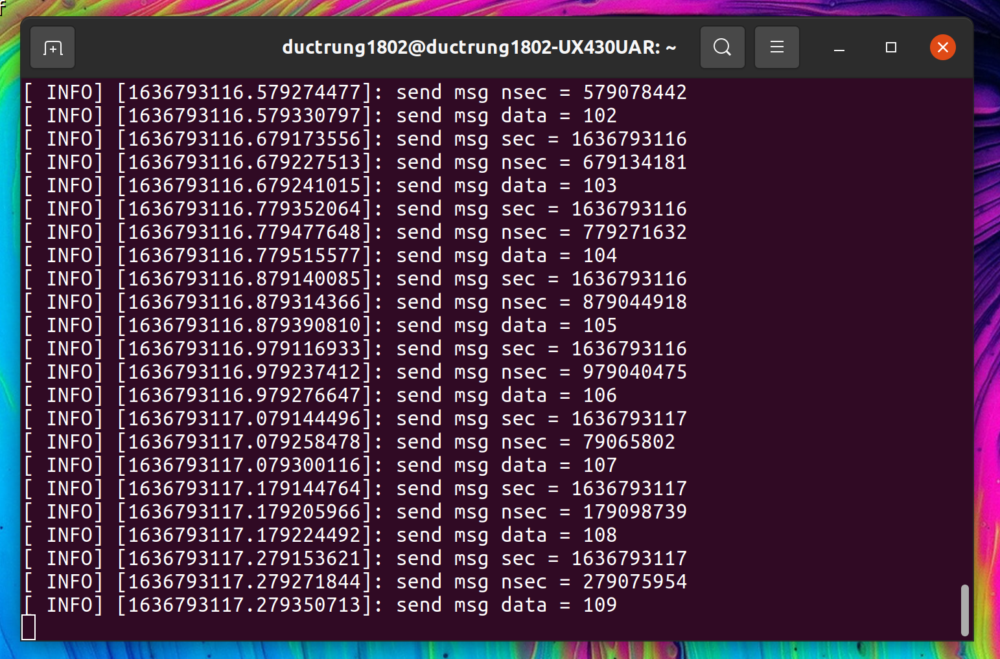
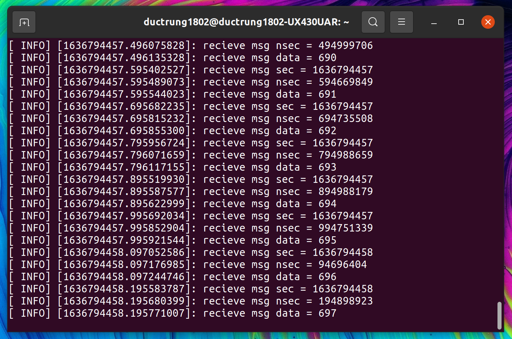

# **Ubuntu install of ROS Noetic**

> NOTE: This instruction focuses on the perfomance installation and running commands. For more detail, you can read pdf book [ROS Robot Programming (35.6 MB)](https://www.robotis.com/service/download.php?no=719) and go to [ROS Official Tutorials](https://wiki.ros.org/ROS/Tutorials).

 

### Previous: [14. ROS Tools #2: ROS GUI Development Tool (rqt)](14-ROS-Tools-(2)-ROS-GUI-Development-Tool-(rqt).md)

 

# 15. Basic ROS Programming #1: Creating and Running Publisher and Subscriber Nodes

The publishers and subscribers used in ROS message communication can be compared with a transmitter and receiver. In ROS, the transmitter is called publisher, and the receiver is called subscriber. This section aims to create a simple message file, and create and run Publisher and Subscriber nodes.

## 1. Creating a Package

The following command creates a ‘ros_tutorials_topic’ package. This package is dependent on the ‘message_generation’, ‘std_msgs’, and ‘roscpp’ packages, as they are appended as dependency options followed by the custom package name. The ‘message_generation’ package will be required to create a new message. ‘std_msgs’ is the ROS standard message package and ‘roscpp’ is the client library to use C/C++ in ROS. These dependent packages can be included while creating the package, but they can also be added after creating the ‘package.xml’ in the package folder.

Open tetminal and run commands:

    cd ~/catkin_ws/src   
    catkin_create_pkg ros_tutorials_topic message_generation std_msgs roscpp

When the package is created, the ‘ros_tutorials_topic’ package folder is created in the ‘~/catkin_ws/src’ folder. In this package folder, the ‘CMakeLists.txt’ and ‘package.xml’ files are created along with default folders. You can inspect it with the ‘ls’ command as below, or check the inside of the package using the GUI-based Nautilus, which is similar to Windows File Explorer.

Run commands:

    cd ros_tutorials_topic
    ls

Output:

CMakeLists.txt  include  msg  package.xml  src

## 2. Modifying the Package Configuration File (package.xml)

The ‘package.xml’ file, one of the required ROS configuration files, is an XML file containing the package information such as the package name, author, license, and dependent packages. Let’s open the file using an editor (such as gedit, vim, emacs, etc.) with the following command and modify it for the current node.

    gedit package.xml

The following code shows how to modify the ‘package.xml’ file to match the package you created. Personal information will be included in the content, so you can modify it as you wish.

    <package format="2">
        <name>ros_tutorials_topic</name>
        <version>0.1.0</version>
        <description>ROS tutorial package to learn the topic</description>
        <!--  One maintainer tag required, multiple allowed, one person per tag  -->
        <!--  Example:   -->
        <!--  <maintainer email="jane.doe@example.com">Jane Doe</maintainer>  -->
        <maintainer email="trung.lyduc18@gmail.com">Ly Duc Trung</maintainer>
        <!--  One license tag required, multiple allowed, one license per tag  -->
        <!--  Commonly used license strings:  -->
        <!--    BSD, MIT, Boost Software License, GPLv2, GPLv3, LGPLv2.1, LGPLv3  -->
        <license>Apache License 2.0</license>
        <!--  Url tags are optional, but multiple are allowed, one per tag  -->
        <!--  Optional attribute type can be: website, bugtracker, or repository  -->
        <!--  Example:  -->
        <!--  <url type="website">http://wiki.ros.org/ros_tutorials_topic</url>  -->
        <!--  Author tags are optional, multiple are allowed, one per tag  -->
        <!--  Authors do not have to be maintainers, but could be  -->
        <!--  Example:  -->
        <author email="trung.lyduc18@gmail.com">Ly Duc Trung</author>
        <!--  The *depend tags are used to specify dependencies  -->
        <!--  Dependencies can be catkin packages or system dependencies  -->
        <!--  Examples:  -->
        <!--  Use depend as a shortcut for packages that are both build and exec dependencies  -->
        <!--    <depend>roscpp</depend>  -->
        <!--    Note that this is equivalent to the following:  -->
        <!--    <build_depend>roscpp</build_depend>  -->
        <!--    <exec_depend>roscpp</exec_depend>  -->
        <!--  Use build_depend for packages you need at compile time:  -->
        <!--    <build_depend>message_generation</build_depend>  -->
        <!--  Use build_export_depend for packages you need in order to build against this package:  -->
        <!--    <build_export_depend>message_generation</build_export_depend>  -->
        <!--  Use buildtool_depend for build tool packages:  -->
        <!--    <buildtool_depend>catkin</buildtool_depend>  -->
        <!--  Use exec_depend for packages you need at runtime:  -->
        <!--    <exec_depend>message_runtime</exec_depend>  -->
        <!--  Use test_depend for packages you need only for testing:  -->
        <!--    <test_depend>gtest</test_depend>  -->
        <!--  Use doc_depend for packages you need only for building documentation:  -->
        <!--    <doc_depend>doxygen</doc_depend>  -->
        <buildtool_depend>catkin</buildtool_depend>
        <build_depend>roscpp</build_depend>
        <build_depend>std_msgs</build_depend>
        <build_depend>message_generation</build_depend>
        <build_export_depend>roscpp</build_export_depend>
        <build_export_depend>std_msgs</build_export_depend>
        <exec_depend>roscpp</exec_depend>
        <exec_depend>std_msgs</exec_depend>
        <exec_depend>message_runtime</exec_depend>
        <!--  The export tag contains other, unspecified, tags  -->
        <export>
        <!--  Other tools can request additional information be placed here  -->
        </export>
    </package>

## 3. Modifying the Build Configuration File (CMakeLists.txt)

Catkin, which is the build system of ROS, uses CMake. Therefore, the build environment is described in the ‘CMakeLists.txt’ file in the package folder. This file configures executable file creation, dependency package priority build, link creation, and so on.

Run command:

    gedit CMakeLists.txt

The following is the modified code of CMakeLists.txt for the package I created. Copy it in CMakeLists.txt.

    cmake_minimum_required(VERSION 3.0.2)
    project(ros_tutorials_topic)

    ## A component package required when building the Catkin.

    ## Has dependency on message_generation, std_msgs, roscpp.
    ## An error occurs during the build if these packages do not exist.
    find_package(catkin REQUIRED COMPONENTS message_generation std_msgs roscpp)
    ## Declaration Message: MsgTutorial.msg
    add_message_files(FILES MsgTutorial.msg)
    ## an option to configure the dependent message.
    ## An error occurs duing the build if "std_msgs" is not installed.
    generate_messages(DEPENDENCIES std_msgs)
    ## A Catkin package option that describes the library, the Catkin build dependencies,
    ## and the system dependent packages.
    catkin_package(
    LIBRARIES ros_tutorials_topic
    CATKIN_DEPENDS std_msgs roscpp
    )
    ## Include directory configuration.
    include_directories(${catkin_INCLUDE_DIRS})
    ## Build option for the "topic_publisher" node.
    ## Configuration of Executable files, target link libraries, and additional dependencies.
    add_executable(topic_publisher src/topic_publisher.cpp)
    add_dependencies(topic_publisher ${${PROJECT_NAME}_EXPORTED_TARGETS} ${catkin_EXPORTED_TARGETS})
    target_link_libraries(topic_publisher ${catkin_LIBRARIES})
    ## Build option for the "topic_subscriber" node.
    add_executable(topic_subscriber src/topic_subscriber.cpp)
    add_dependencies(topic_subscriber ${${PROJECT_NAME}_EXPORTED_TARGETS}
    ${catkin_EXPORTED_TARGETS})
    target_link_libraries(topic_subscriber ${catkin_LIBRARIES})

## 4. Writing the Message File

The following option is added to the CMakeLists.txt file.

    add_message_files(FILES MsgTutorial.msg)

The above option indicates to include the message file ‘MsgTutorial.msg’, which will be used in this example node, when building the package. As ‘MsgTutorial.msg’ has not been created yet, open a new terminal and run the following commands to create the file:

    roscd ros_tutorials_topic
    mkdir msg
    cd msg
    gedit MsgTutorial.msg

The content in the message file is quite simple. There are time type of **‘stamp’** and **‘int32’** type of data variables in the message. Other than these two types, the following types are also available: basic message types such as **‘bool’**, **‘int8’**, **‘int16’**, **‘float32’**, **‘string’**, **time’**, **‘duration’**, and ‘common_msgs’ 8 which is a collection of messages frequently used in ROS. In this simple example, we use time and int32.

Copy 2 entries into MsgTutorial.msg. They are type of variables to be sent in messages.

    time stamp
    int32 data

## 5. Writing the Publisher Node

The following option was previously configured in the ‘CMakeLists.txt’ file to create an executable file:

    add_executable(topic_publisher src/topic_publisher.cpp)

That is, the ‘topic_publisher.cpp’ file is built in the src’ folder to create the ‘topic_publisher’ executable file. Open terminal and run:

    roscd ros_tutorials_topic/src
    gedit topic_publisher.cpp

Let’s create a code that performs publisher node functions with the following code:

    // ROS Default Header File
    #include "ros/ros.h"
    #include "ros_tutorials_topic/MsgTutorial.h"
    // MsgTutorial Message File Header
    // The header file is automatically created when building the package.

    int main(int argc, char **argv)		
    // Node Main Function
    {
        ros::init(argc, argv, "topic_publisher"); // Initializes Node Name
        ros::NodeHandle nh;		
        // Node handle declaration for communication with ROS system
        // Declare publisher, create publisher 'ros_tutorial_pub' using the 'MsgTutorial'
        // message file from the 'ros_tutorials_topic' package. The topic name is
        // 'ros_tutorial_msg' and the size of the publisher queue is set to 100.
        ros::Publisher ros_tutorial_pub =
        nh.advertise<ros_tutorials_topic::MsgTutorial>("ros_tutorial_msg", 100);

        // Set the loop period. '10' refers to 10 Hz and the main loop repeats at 0.1 second intervals
        ros::Rate loop_rate(10);
        ros_tutorials_topic::MsgTutorial msg;
                                    
        int count = 0;					
        // Declares message 'msg' in 'MsgTutorial' message
        // file format
        // Variable to be used in message
        
        while (ros::ok())
        {
            msg.stamp = ros::Time::now(); // Save current time in the stamp of 'msg'
            msg.data
            = count;
            // Save the the 'count' value in the data of 'msg'
            ROS_INFO("send msg sec = %d", msg.stamp.sec);	// Print the 'stamp.sec' message
            ROS_INFO("send msg nsec = %d", msg.stamp.nsec); // Print the 'stamp.nsec' message
            ROS_INFO("send msg data = %d", msg.data);		 // Print the 'data' message
            ros_tutorial_pub.publish(msg);		 // Publishes 'msg' message
            loop_rate.sleep();			 // Goes to sleep according to the loop rate defined above.
            ++count;					 // Increase count variable by one
        }
        return 0;
    }

## 6. Writing the Subscriber Node

The following is an option in the ‘CMakeLists.txt’ file to generate the executable file.

    add_executable(topic_subscriber src/topic_subscriber.cpp)

This mean that the ‘topic_publisher.cpp’ file is built to create the ‘topic_subscriber’ executable
file. Open terminal and run:

    roscd ros_tutorials_topic/src
    gedit topic_subscriber.cpp

Let’s write a code that performs subscriber node functions with the following code:

    // ROS Default Header File
    #include "ros/ros.h"
    // MsgTutorial Message File Header
    // The header file is automatically created when building the package.
    #include "ros_tutorials_topic/MsgTutorial.h"
    // Message callback function. This is a function is called when a topic
    // message named 'ros_tutorial_msg' is received. As an input message,
    // the 'MsgTutorial' message of the 'ros_tutorials_topic' package is received.

    void msgCallback(const ros_tutorials_topic::MsgTutorial::ConstPtr& msg)
    {
        ROS_INFO("recieve msg = %d", msg->stamp.sec);
        // Shows the 'stamp.sec' message

        ROS_INFO("recieve msg = %d", msg->stamp.nsec); // Shows the 'stamp.nsec' message
        ROS_INFO("recieve msg = %d", msg->data);		 // Shows the 'data' message
    }

    int main(int argc, char **argv)			
    // Node Main Function
    {
        ros::init(argc, argv, "topic_subscriber");
        ros::NodeHandle nh;
        // Initializes Node Name
        // Node handle declaration for communication with ROS system
        // Declares subscriber. Create subscriber 'ros_tutorial_sub' using the 'MsgTutorial'
        // message file from the 'ros_tutorials_topic' package. The topic name is
        // 'ros_tutorial_msg' and the size of the publisher queue is set to 100.
        ros::Subscriber ros_tutorial_sub = nh.subscribe("ros_tutorial_msg", 100, msgCallback);
        // A function for calling a callback function, waiting for a message to be
        // received, and executing a callback function when it is received
        ros::spin();
        
        return 0;
    }

## 7. Building a Node

**`Note: These following terminals run together.`**

Now let’s build the message file, publisher node, and subscriber node in the ‘ros_tutorials_topic’ package with the following command. The source of the ‘ros_tutorials_topic’ package is in `‘~/catkin_ws/src/ros_tutorials_topic/src’`, and the message file of the ‘ros_tutorials_topic’ package is in `‘~/catkin_ws/src/ros_tutorials_topic/msg’`.

Run the following commands:

    cd ~/catkin_ws
    catkin_make

The output files of built package will be located in the ‘/build’ and ‘/devel’ folders in ‘~/catkin_ws’. The configuration used in Catkin build is stored in ‘/build’ folder, and executable files are stored in ‘/devel/lib/ros_tutorials_topic’ and the message header file that is automatically generated from the message file is stored in ‘/devel/include/ros_tutorials_topic’. Check the files in each folder above to verify the created output.

## 8. Running the Publisher

Now let’s run the publisher. The following is a command to run the ‘ros_tutorial_msg_publisher’ node of the ‘ros_tutorials_topic’ package using the ‘rosrun’ command. Be sure to run ‘roscore’ from another terminal before running the publisher node. From now on, we will assume ‘roscore’ is executed before the node execution.

Run each command in a new terminal:

    roscore
    rosrun ros_tutorials_topic topic_publisher

When you run the publisher, you can see the output screen shown in below figure. However, the string displayed on the screen is the data in the publisher using the ROS_INFO() function, which is similar to the printf() function used in common programming languages. In order to actually publish the message on topic, we must use a command that acts as a subscriber node, such as a subscriber node or rostopic.

Let’s use the ‘rostopic’ command to receive the topic published by ‘topic_publisher’. First, list up the topics currently running on the ROS. Use ‘rostopic list’ command to verify that the ‘ros_tutorial_msg’ topic is running. Open a new terminal and run:

    rostopic list

Output:

    /ros_tutorial_msg
    /rosout
    /rosout_agg

Next, let’s verify the message being published from the publisher node. In other words, read the message on the ‘ros_tutorial_msg’ topic. You can see the published message as shown in below figure.

Run this command in a new terminal:

    rostopic echo /ros_tutorial_msg

## 9. Running the Subscriber

The following is the command to run the ‘topic_subscriber’ node of ‘ros_tutorials_topic’ package using the ‘rosrun’ command to run the subscriber.

Run:

    rosrun ros_tutorials_topic topic_subscriber

When the subscriber is executed, the output screen is shown as in following figure. The published message on the ‘ros_tutorial_msg’ topic is received, and the value is displayed on the screen.

## 10. Checking the Communication Status of the Running Nodes

Next, let’s check the communication status of executed nodes using ‘rqt’ from Section 6.2. You
can use either ‘rqt_graph’ or ‘rqt’ command as shown below. When executing ‘rqt’, select
[Plugins] → [Introspection] → [Node Graph] from the menu and currently running nodes and
messages can be seen as shown in the following figure.

Run:

    rqt_graph

In the figure above, we can observe that the publisher node (topic_publisher) is transmitting a topic (ros_tutorial_msg), and the topic is received by the subscriber node (topic_subscriber) and the echo node (/rostopic...).

