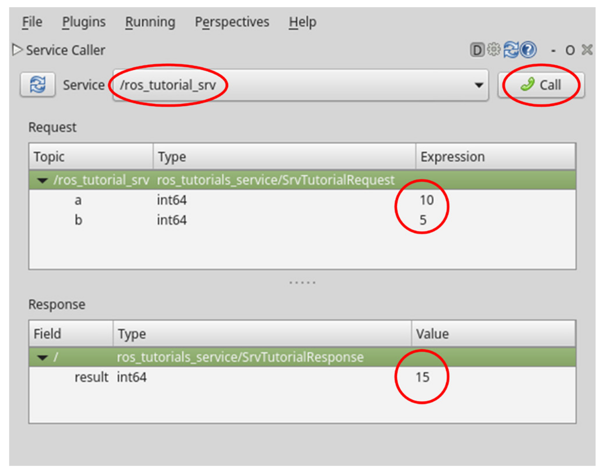

# **Ubuntu install of ROS Noetic**

> NOTE: This instruction focuses on the perfomance installation and running commands. For more detail, you can read pdf book [ROS Robot Programming (35.6 MB)](https://www.robotis.com/service/download.php?no=719) and go to [ROS Official Tutorials](https://wiki.ros.org/ROS/Tutorials).

 

### Previous: [15. Basic ROS Programming #1: Creating and Running Publisher and Subscriber Nodes](15-Basic-ROS-Programming-(1)-Creating-and-Running-Publisher-and-Subscriber-Nodes.md)

 

# 16. Basic ROS Programming #2: Creating and Running Service Servers and Client Nodes

A service can be divided into two types: a Service Server that responds only when there is a request and a Service Client that can send both requests and respond to requests. Unlike the topic, the service is a one-time message communication. Therefore, when the request and the response of the service are completed, the two connected nodes will be disconnected.

These services are often used when requesting a robot to perform a specific action. Alternatively, it is used for nodes that require specific events to occur under certain conditions. As service is a single occurrence of communication method, it is a very useful method that can replace the topic with a small network bandwidth.

In this section, we will create a simple service file and run a service  server node and a service client node.

## 1. Creating a Package

The following command creates the ‘ros_tutorials_service’ package. This package has dependency on the ‘message_generation’, ‘std_msgs’, and ‘roscpp’ packages, so dependency option was appended. The ‘message_generation’ package is used to create a new message. The ‘std_msgs’ package is the ROS standard message package, and the ‘roscpp’ package allows the client library to use C++ in ROS. These can be included while creating the package, but it may also be added after creating the ‘package.xml’ file.

Open a new terminal and run commands:

    cd ~/catkin_ws/src
    catkin_create_pkg ros_tutorials_service message_generation std_msgs roscpp

When the package is created, the ‘ros_tutorials_service’ package folder is created in the ‘~/catkin_ws/src’ folder. In this package folder, the ‘CMakeLists.txt’ and ‘package.xml’ files are created along with default folders. You can inspect it with the ‘ls’ command as shown below,

Run commands:

    cd ros_tutorials_service
    ls

Output:

    CMakeLists.txt  include  package.xml  src

## 2. Modifying the Package Configuration File (package.xml)

The ‘package.xml’ file is one of the necessary ROS configuration files. It is an XML file containing package information such as the package name, author, license, and dependent packages. Let’s open the file using an editor (such as gedit, vim, emacs, etc.) with the following command and modify it for the intended node.

Run command:

    gedit package.xml

The following code shows how to modify the ‘package.xml’ file to serve the package you are creating. Personal information is included in the content, so you can modify it as needed.

    <?xml version="1.0"?>
    <package format="2">
        <name>ros_tutorials_service</name>
        <version>0.0.0</version>
        <description>The ros_tutorials_service package</description>

        <!-- One maintainer tag required, multiple allowed, one person per tag -->
        <!-- Example:  -->
        <!-- <maintainer email="jane.doe@example.com">Jane Doe</maintainer> -->
            <maintainer email="trung.lyduc18@gmail.com">Ly Duc Trung</maintainer>

        <!-- One license tag required, multiple allowed, one license per tag -->
        <!-- Commonly used license strings: -->
        <!--   BSD, MIT, Boost Software License, GPLv2, GPLv3, LGPLv2.1, LGPLv3 -->
        <license>Apache License 2.0</license>

        <!-- Url tags are optional, but multiple are allowed, one per tag -->
        <!-- Optional attribute type can be: website, bugtracker, or repository -->
        <!-- Example: -->
        <!-- <url type="website">http://wiki.ros.org/ros_tutorials_service</url> -->

        <!-- Author tags are optional, multiple are allowed, one per tag -->
        <!-- Authors do not have to be maintainers, but could be -->
        <!-- Example: -->
        <!-- <author email="jane.doe@example.com">Jane Doe</author> -->

        <!-- The *depend tags are used to specify dependencies -->
        <!-- Dependencies can be catkin packages or system dependencies -->
        <!-- Examples: -->
        <!-- Use depend as a shortcut for packages that are both build and exec dependencies -->
        <!--   <depend>roscpp</depend> -->
        <!--   Note that this is equivalent to the following: -->
        <!--   <build_depend>roscpp</build_depend> -->
        <!--   <exec_depend>roscpp</exec_depend> -->
        <!-- Use build_depend for packages you need at compile time: -->
        <!--   <build_depend>message_generation</build_depend> -->
        <!-- Use build_export_depend for packages you need in order to build against this package: -->
        <!--   <build_export_depend>message_generation</build_export_depend> -->
        <!-- Use buildtool_depend for build tool packages: -->
        <!--   <buildtool_depend>catkin</buildtool_depend> -->
        <!-- Use exec_depend for packages you need at runtime: -->
        <!--   <exec_depend>message_runtime</exec_depend> -->
        <!-- Use test_depend for packages you need only for testing: -->
        <!--   <test_depend>gtest</test_depend> -->
        <!-- Use doc_depend for packages you need only for building documentation: -->
        <!--   <doc_depend>doxygen</doc_depend> -->
        <buildtool_depend>catkin</buildtool_depend>
        <build_depend>message_generation</build_depend>
        <build_depend>roscpp</build_depend>
        <build_depend>std_msgs</build_depend>
        <build_export_depend>roscpp</build_export_depend>
        <build_export_depend>std_msgs</build_export_depend>
        <exec_depend>roscpp</exec_depend>
        <exec_depend>std_msgs</exec_depend>

        <!-- The export tag contains other, unspecified, tags -->
        <export>
            <!-- Other tools can request additional information be placed here -->

        </export>
    </package>

## 3. Modifying the Build Configuration File (CMakeLists.txt)

The ROS build system catkin uses CMake. Therefore, the build environment is described in the ‘CMakeLists.txt’ file in the package folder. This file configures executable file creation, dependency package build priority, link creation, and so on. The difference from the ‘ros_tutorials_topic’ described above is that the ‘ros_tutorials_service’ package adds a new service server node, service client node, and service file (*.srv) whereas the ‘ros_tutorials_topic’ added
the publisher node, subscriber node, and msg file.

The following code is in the newest form of ROS Noetic. I had modified it for running the node. You can copy it and paste into your CMakeLists.txt of your 'ros_tutorials_service' package.

    cmake_minimum_required(VERSION 3.0.2)
    project(ros_tutorials_service)

    ## Compile as C++11, supported in ROS Kinetic and newer
    # add_compile_options(-std=c++11)

    ## Find catkin macros and libraries
    ## if COMPONENTS list like find_package(catkin REQUIRED COMPONENTS xyz)
    ## is used, also find other catkin packages
    find_package(catkin REQUIRED COMPONENTS
    message_generation
    roscpp
    std_msgs
    )

    ## System dependencies are found with CMake's conventions
    # find_package(Boost REQUIRED COMPONENTS system)

    ## Uncomment this if the package has a setup.py. This macro ensures
    ## modules and global scripts declared therein get installed
    ## See http://ros.org/doc/api/catkin/html/user_guide/setup_dot_py.html
    # catkin_python_setup()

    ################################################
    ## Declare ROS messages, services and actions ##
    ################################################

    ## To declare and build messages, services or actions from within this
    ## package, follow these steps:
    ## * Let MSG_DEP_SET be the set of packages whose message types you use in
    ##   your messages/services/actions (e.g. std_msgs, actionlib_msgs, ...).
    ## * In the file package.xml:
    ##   * add a build_depend tag for "message_generation"
    ##   * add a build_depend and a exec_depend tag for each package in MSG_DEP_SET
    ##   * If MSG_DEP_SET isn't empty the following dependency has been pulled in
    ##     but can be declared for certainty nonetheless:
    ##     * add a exec_depend tag for "message_runtime"
    ## * In this file (CMakeLists.txt):
    ##   * add "message_generation" and every package in MSG_DEP_SET to
    ##     find_package(catkin REQUIRED COMPONENTS ...)
    ##   * add "message_runtime" and every package in MSG_DEP_SET to
    ##     catkin_package(CATKIN_DEPENDS ...)
    ##   * uncomment the add_*_files sections below as needed
    ##     and list every .msg/.srv/.action file to be processed
    ##   * uncomment the generate_messages entry below
    ##   * add every package in MSG_DEP_SET to generate_messages(DEPENDENCIES ...)

    add_service_files(FILES SrvTutorial.srv)

    ## Generate messages in the 'msg' folder
    # add_message_files(
    #   FILES
    #   Message1.msg
    #   Message2.msg
    # )

    ## Generate services in the 'srv' folder
    # add_service_files(
    #   FILES
    #   Service1.srv
    #   Service2.srv
    # )

    ## Generate actions in the 'action' folder
    # add_action_files(
    #   FILES
    #   Action1.action
    #   Action2.action
    # )

    ## Generate added messages and services with any dependencies listed here
    # generate_messages(
    #   DEPENDENCIES
    #   std_msgs
    # )

    generate_messages(DEPENDENCIES std_msgs)

    ################################################
    ## Declare ROS dynamic reconfigure parameters ##
    ################################################

    ## To declare and build dynamic reconfigure parameters within this
    ## package, follow these steps:
    ## * In the file package.xml:
    ##   * add a build_depend and a exec_depend tag for "dynamic_reconfigure"
    ## * In this file (CMakeLists.txt):
    ##   * add "dynamic_reconfigure" to
    ##     find_package(catkin REQUIRED COMPONENTS ...)
    ##   * uncomment the "generate_dynamic_reconfigure_options" section below
    ##     and list every .cfg file to be processed

    ## Generate dynamic reconfigure parameters in the 'cfg' folder
    # generate_dynamic_reconfigure_options(
    #   cfg/DynReconf1.cfg
    #   cfg/DynReconf2.cfg
    # )

    ###################################
    ## catkin specific configuration ##
    ###################################
    ## The catkin_package macro generates cmake config files for your package
    ## Declare things to be passed to dependent projects
    ## INCLUDE_DIRS: uncomment this if your package contains header files
    ## LIBRARIES: libraries you create in this project that dependent projects also need
    ## CATKIN_DEPENDS: catkin_packages dependent projects also need
    ## DEPENDS: system dependencies of this project that dependent projects also need
    catkin_package(
    #  INCLUDE_DIRS include
    #  LIBRARIES ros_tutorials_service
    #  CATKIN_DEPENDS message_generation roscpp std_msgs
    #  DEPENDS system_lib
    )

    catkin_package(
    LIBRARIES ros_tutorials_service
    CATKIN_DEPENDS std_msgs roscpp
    )

    ###########
    ## Build ##
    ###########

    ## Specify additional locations of header files
    ## Your package locations should be listed before other locations
    include_directories(
    # include
    ${catkin_INCLUDE_DIRS}
    )

    ## Declare a C++ library
    # add_library(${PROJECT_NAME}
    #   src/${PROJECT_NAME}/ros_tutorials_service.cpp
    # )

    ## Add cmake target dependencies of the library
    ## as an example, code may need to be generated before libraries
    ## either from message generation or dynamic reconfigure
    # add_dependencies(${PROJECT_NAME} ${${PROJECT_NAME}_EXPORTED_TARGETS} ${catkin_EXPORTED_TARGETS})

    ## Declare a C++ executable
    ## With catkin_make all packages are built within a single CMake context
    ## The recommended prefix ensures that target names across packages don't collide
    # add_executable(${PROJECT_NAME}_node src/ros_tutorials_service_node.cpp)

    ## Build option for the "service_server" node.
    add_executable(service_server src/service_server.cpp)

    ## Build option for the "service_client" node.
    add_executable(service_client src/service_client.cpp)

    ## Rename C++ executable without prefix
    ## The above recommended prefix causes long target names, the following renames the
    ## target back to the shorter version for ease of user use
    ## e.g. "rosrun someones_pkg node" instead of "rosrun someones_pkg someones_pkg_node"
    # set_target_properties(${PROJECT_NAME}_node PROPERTIES OUTPUT_NAME node PREFIX "")

    ## Add cmake target dependencies of the executable
    ## same as for the library above
    # add_dependencies(${PROJECT_NAME}_node ${${PROJECT_NAME}_EXPORTED_TARGETS} ${catkin_EXPORTED_TARGETS})

    ## Build option for the "service_server" node.
    add_dependencies(service_server ${${PROJECT_NAME}_EXPORTED_TARGETS}{catkin_EXPORTED_TARGETS})

    ## Build option for the "service_client" node.
    add_dependencies(service_client ${${PROJECT_NAME}_EXPORTED_TARGETS} ${catkin_EXPORTED_TARGETS})

    ## Specify libraries to link a library or executable target against
    # target_link_libraries(${PROJECT_NAME}_node
    #   ${catkin_LIBRARIES}
    # )

    ## Build option for the "service_server" node.
    target_link_libraries(service_server ${catkin_LIBRARIES})

    ## Build option for the "service_client" node.
    target_link_libraries(service_client ${catkin_LIBRARIES})

    #############
    ## Install ##
    #############

    # all install targets should use catkin DESTINATION variables
    # See http://ros.org/doc/api/catkin/html/adv_user_guide/variables.html

    ## Mark executable scripts (Python etc.) for installation
    ## in contrast to setup.py, you can choose the destination
    # catkin_install_python(PROGRAMS
    #   scripts/my_python_script
    #   DESTINATION ${CATKIN_PACKAGE_BIN_DESTINATION}
    # )

    ## Mark executables for installation
    ## See http://docs.ros.org/melodic/api/catkin/html/howto/format1/building_executables.html
    # install(TARGETS ${PROJECT_NAME}_node
    #   RUNTIME DESTINATION ${CATKIN_PACKAGE_BIN_DESTINATION}
    # )

    ## Mark libraries for installation
    ## See http://docs.ros.org/melodic/api/catkin/html/howto/format1/building_libraries.html
    # install(TARGETS ${PROJECT_NAME}
    #   ARCHIVE DESTINATION ${CATKIN_PACKAGE_LIB_DESTINATION}
    #   LIBRARY DESTINATION ${CATKIN_PACKAGE_LIB_DESTINATION}
    #   RUNTIME DESTINATION ${CATKIN_GLOBAL_BIN_DESTINATION}
    # )

    ## Mark cpp header files for installation
    # install(DIRECTORY include/${PROJECT_NAME}/
    #   DESTINATION ${CATKIN_PACKAGE_INCLUDE_DESTINATION}
    #   FILES_MATCHING PATTERN "*.h"
    #   PATTERN ".svn" EXCLUDE
    # )

    ## Mark other files for installation (e.g. launch and bag files, etc.)
    # install(FILES
    #   # myfile1
    #   # myfile2
    #   DESTINATION ${CATKIN_PACKAGE_SHARE_DESTINATION}
    # )

    #############
    ## Testing ##
    #############

    ## Add gtest based cpp test target and link libraries
    # catkin_add_gtest(${PROJECT_NAME}-test test/test_ros_tutorials_service.cpp)
    # if(TARGET ${PROJECT_NAME}-test)
    #   target_link_libraries(${PROJECT_NAME}-test ${PROJECT_NAME})
    # endif()

    ## Add folders to be run by python nosetests
    # catkin_add_nosetests(test)

## 4. Writing the Service File

The following option is added to the ‘CMakeLists.txt’ file.

    add_service_files(FILES SrvTutorial.srv)

This option will include the ‘SrvTutorial.srv’ when building the package, which will be used
in this node. Let’s create the ‘SrvTutorial.srv’ file. 

Open a new terminal and run:

    roscd ros_tutorials_service
    mkdir srv
    cd srv
    gedit SrvTutorial.srv

Let’s create an ‘int64’ type of ‘a’ and ‘b’ service requests and ‘result’ service response as follows. The ‘---’ is a delimiter that separates the request and the response. The structure is similar to the message of the topic described above, except the delimiter ‘---’ that separates the request and response messages.

    int64 a
    int64 b
    ---
    int64 result

## 5. Writing the Service Server Node

The following option is added to the ‘CMakeLists.txt’ file.

    add_executable(service_server src/service_server.cpp)

This meaning, the ‘service_server.cpp’ file is built to create the ‘service_server’ executable
file. Let’s create the code that performs the service server node function.

Open a new terminal and run:

    roscd ros_tutorials_service/src
    gedit service_server.cpp

Fill the **service_server.cpp** file with the following code.

    // ROS Default Header File
    #include "ros/ros.h"
    // SrvTutorial Service File Header (Automatically created after build)
    #include "ros_tutorials_service/SrvTutorial.h"

    // The below process is performed when there is a service request
    // The service request is declared as 'req', and the service response is declared as 'res'
    bool calculation(ros_tutorials_service::SrvTutorial::Request &req,
    ros_tutorials_service::SrvTutorial::Response &res)
    {
        // The service name is 'ros_tutorial_srv' and it will call 'calculation' function
        // upon the service request.
        res.result = req.a + req.b;
        // Displays 'a' and 'b' values used in the service request and
        // the 'result' value corresponding to the service response
        ROS_INFO("request: x=%ld, y=%ld", (long int)req.a, (long int)req.b);
        ROS_INFO("sending back response: %ld", (long int)res.result);
        
        return true;
    }

    int main(int argc, char **argv)
    // Node Main Function
    {
        ros::init(argc, argv, "service_server");  // Initializes Node Name
        ros::NodeHandle nh;                       // Node handle declaration
        
        // Declare service server 'ros_tutorials_service_server'
        // using the 'SrvTutorial' service file in the 'ros_tutorials_service' package.
        // The service name is 'ros_tutorial_srv' and it will call 'calculation' function
        // upon the service request.
        ros::ServiceServer ros_tutorials_service_server = nh.advertiseService("ros_tutorial_srv",
        calculation);
        
        ROS_INFO("ready srv server!");
        
        ros::spin();        // Wait for the service request
        
        return 0;
    }

## 6. Writing the Service Client Node

The following option is added to the ‘CMakeLists.txt’ file to generate the executable file.

    add_executable(service_client src/service_client.cpp)

When the ‘service_client.cpp’ file is built, the ‘service_client’ executable file will be generated. Let’s create a code that performs the service client node function.

Open a new terminal and run:

    roscd ros_tutorials_service/src
    gedit service_client.cpp

Fill the **service_client.cpp** file with the following code.

    #include "ros/ros.h"
    // ROS Default Header File
    // SrvTutorial Service File Header (Automatically created after build)
    #include "ros_tutorials_service/SrvTutorial.h"
    #include <cstdlib>					 // Library for using the "atoll" function

    int main(int argc, char **argv)			 // Node Main Function
    {
        ros::init(argc, argv, "service_client");		
        
        if (argc != 3)				
        // Initializes Node Name
        // input value error handling
        {
            ROS_INFO("cmd : rosrun ros_tutorials_service service_client arg0 arg1");
            ROS_INFO("arg0: double number, arg1: double number");
            return 1;
        }
        
        ros::NodeHandle nh;
        // Node handle declaration for communication with ROS system
        // Declares service client 'ros_tutorials_service_client'
        // using the 'SrvTutorial' service file in the 'ros_tutorials_service' package.
        // The service name is 'ros_tutorial_srv'
        ros::ServiceClient ros_tutorials_service_client =
        nh.serviceClient<ros_tutorials_service::SrvTutorial>("ros_tutorial_srv");
        // Declares the 'srv' service that uses the 'SrvTutorial' service file
        ros_tutorials_service::SrvTutorial srv;
        // Parameters entered when the node is executed as a service request value are stored at 'a' and 'b'
        srv.request.a = atoll(argv[1]);
        srv.request.b = atoll(argv[2]);
        // Request the service. If the request is accepted, display the response value
        
        if (ros_tutorials_service_client.call(srv))
        {
            ROS_INFO("send srv, srv.Request.a and b: %ld, %ld", (long int)srv.request.a, (long
            int)srv.request.b);
            ROS_INFO("receive srv, srv.Response.result: %ld", (long int)srv.response.result);
        }
        
        else
        {
            ROS_ERROR("Failed to call service ros_tutorial_srv");
            return 1;
        }
        
        return 0;
    }

## 7. Building Nodes

Build the service file, service server node and service client node in the ‘ros_tutorials_service’ package with the following command. The source of the ‘ros_tutorials_service’ package is in ‘~/catkin_ws/src/ros_tutorials_service/src’, and the service file is in ‘~/catkin_ws/src/ros_tutorials_service/srv’.

Run:

    cd ~/catkin_ws && catkin_make #Go to the catkin folder and run the catkin build

The output of the build is saved in the ‘~/catkin_ws/build’ and ‘~/catkin_ws/devel’ folders. The executable files are stored in ‘~/catkin_ws/devel/lib/ros_tutorials_service’ and the catkin build configuration is stored in ‘~/catkin_ws/build’. The service header file that is automatically generated from the message file is stored in ‘~/catkin_ws/devel/include/ros_tutorials_service’. Check the files in each path above to verify the created output.

**`Note: These following terminals run together.`**

## 8. Running the Service Server

The service server written in the previous section is programmed to wait until there is a service request. Therefore, when the following command is executed, the service server will be launched and waits for a service request. Be sure to run ‘roscore’ before running the node.

Open a new terminal and run:

    roscore

Open another terminal and run:

    rosrun ros_tutorials_service service_server

Output:

    [ INFO] [1636822260.125656996]: ready srv server!

## 9. Running the Service Client

After running the service server, open a new terminal and run the service client with the following command:

    rosrun ros_tutorials_service service_client 2 3

Output:

    [ INFO] [1636822342.123420692]: send srv, srv.Request.a and b: 2, 3
    [ INFO] [1636822342.124493179]: receive srv, srv.Response.result: 5

The parameter 2 and 3 entered with execution command are programmed to be transmitted as the service request values. As a result, a and b requested service as a value of 2 and 3 respectively, and the sum of these two values is transmitted as a response value. In this case, execution parameter is used as a service request, but actually, it can be replaced with a command, or a value to be calculated and a variable for a trigger can be used as a service request.

_and_Topic_Subscriber_(right).png)

Note that the service can’t be seen in the ‘rqt_graph’ because it is a one-time communication
while Topic publishers and subscribers are maintaining the connection as shown in above figure.

## 10. Using the rosservice call Command

The service request can be executed by launching a service client node such as ‘service_client’ from above example, but there is also a method using the ‘rosservice call’ command or the ‘Service Caller’ of ‘rqt’. Let’s look at how to use the ‘rosservice call’.

Write the corresponding service name, such as ‘/ros_tutorial_srv’, after the rosservice call command as shown in the command below. This is followed by the required parameters for the service request.

Run:

    rosservice call /ros_tutorial_srv 10 2

Output:

    result: 12

In the previous example, we set the ‘int64’ type variable ‘a’ and ‘b’ as the request as shown in the service file below, so we entered ‘10’ and ‘2’ as parameters. The ‘int64’ type of ‘12’ is returned as a ‘result’ of the service response.

    int64 a
    int64 b
    ---
    int64 result

## 11. Using the GUI Tool, Service Caller

Finally, there is a method of using rqt’s ‘ServiceCaller’, which is a GUI tool. First, let’s run ‘rqt’, the ROS GUI tool.

    rqt

Next, select [Plugins] → [Services] → [Service Caller] from the menu of the ‘rqt’ program and the below screen will appear.

If you select the service name in the Service field at the top, you will see the information required for the service request in the Request field. To request a service, enter the information in the Expression of each request information. ‘10’ was entered for ‘a’, and ‘5’ was entered for ‘b’. Upon clicking on the `<Call>` icon in the form of a green phone at the upper right corner, the service request will be executed, and the response at the bottom of the screen will show the ‘result’ of the service response.

The rosservice call described above has the advantage of running directly on the terminal, but for those who are unfamiliar with Linux or ROS commands, we recommend to use rqt’s ‘Service Caller’.

**In this section, we have created the service server and the service client, and executed them to learn how to communicate between nodes with service.**

