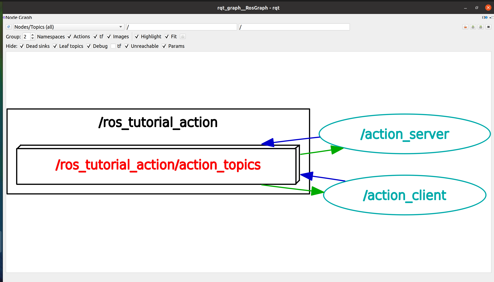
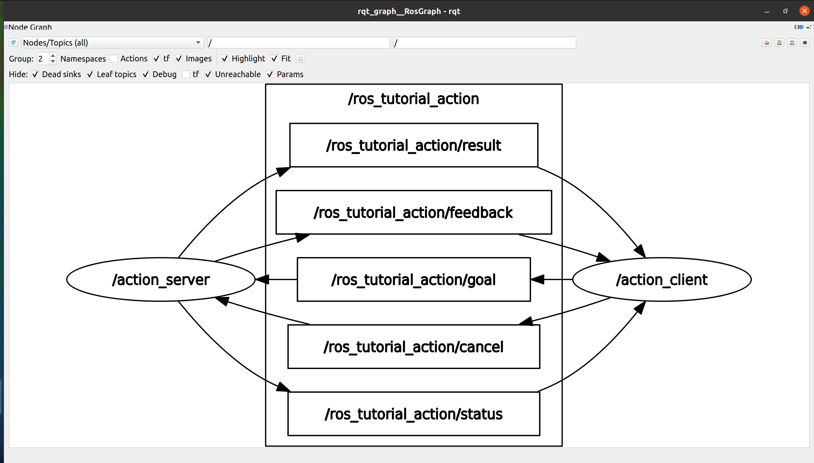

# **Ubuntu install of ROS Noetic**

> NOTE: This instruction focuses on the perfomance installation and running commands. For more detail, you can read pdf book [ROS Robot Programming (35.6 MB)](https://www.robotis.com/service/download.php?no=719) and go to [ROS Official Tutorials](https://wiki.ros.org/ROS/Tutorials).

 

### Previous: [16. Basic ROS Programming #2: Creating and Running Service Servers and Client Nodes](16-Basic-ROS-Programming-(2)-Creating-and-Running-Service-Servers-and-Client-Nodes.md)

 

# 17. Basic ROS Programming #3: Writing and Running the Action Server and Client Node

In this section, we will create and run action server and action client nodes, and we will look at Action, which is the third message communication method we discussed in Section 7. Unlike topics and services, actions are very useful for asynchronous, bidirectional, and more complex programming where an extended response time is expected, after processing request and intermediate feedbacks are needed. Here we will use the ‘actionlib’ example 10 introduced in the ROS Wiki.

## 1. Creating a Package

The following command creates a ‘ros_tutorials_action’ package. This package has dependency on the ‘message_generation’, ‘std_msgs’, ‘actionlib_msgs’, ‘actionlib’, ‘roscpp’ packages, so the according dependency option was included.

Run commands:

    cd ~/catkin_ws/src
    catkin_create_pkg ros_tutorials_action message_generation std_msgs actionlib_msgs actionlib roscpp

## 2. Modifying the Package Configuration File (package.xml)

Much of the process for this, including modifying the package configuration file (package.xml), is very similar to that of the topic and service described above. Except for specific details that need to be mentioned for this example, only the source code will be provided and we will skip the details.

Run commands:

    roscd ros_tutorials_action
    gedit package.xml

For this package, you just need to modify `version`, `maintainer email`, `author email` and `license`. I have my modified package as follows.

    <?xml version="1.0"?>
    <package format="2">
        <name>ros_tutorials_action</name>
        <version>0.1.0</version>
        <description>The ros_tutorials_action package</description>

        <!-- One maintainer tag required, multiple allowed, one person per tag -->
        <!-- Example:  -->
        <!-- <maintainer email="jane.doe@example.com">Jane Doe</maintainer> -->
        <maintainer email="trung.lyduc18@gmail.com">Ly Duc Trung</maintainer>

        <!-- One license tag required, multiple allowed, one license per tag -->
        <!-- Commonly used license strings: -->
        <!--   BSD, MIT, Boost Software License, GPLv2, GPLv3, LGPLv2.1, LGPLv3 -->
        <license>Apache License 2.0</license>

        <!-- Url tags are optional, but multiple are allowed, one per tag -->
        <!-- Optional attribute type can be: website, bugtracker, or repository -->
        <!-- Example: -->
        <!-- <url type="website">http://wiki.ros.org/ros_tutorials_action</url> -->

        <!-- Author tags are optional, multiple are allowed, one per tag -->
        <!-- Authors do not have to be maintainers, but could be -->
        <!-- Example: -->
        <!-- <author email="jane.doe@example.com">Jane Doe</author> -->

        <!-- The *depend tags are used to specify dependencies -->
        <!-- Dependencies can be catkin packages or system dependencies -->
        <!-- Examples: -->
        <!-- Use depend as a shortcut for packages that are both build and exec dependencies -->
        <!--   <depend>roscpp</depend> -->
        <!--   Note that this is equivalent to the following: -->
        <!--   <build_depend>roscpp</build_depend> -->
        <!--   <exec_depend>roscpp</exec_depend> -->
        <!-- Use build_depend for packages you need at compile time: -->
        <!--   <build_depend>message_generation</build_depend> -->
        <!-- Use build_export_depend for packages you need in order to build against this package: -->
        <!--   <build_export_depend>message_generation</build_export_depend> -->
        <!-- Use buildtool_depend for build tool packages: -->
        <!--   <buildtool_depend>catkin</buildtool_depend> -->
        <!-- Use exec_depend for packages you need at runtime: -->
        <!--   <exec_depend>message_runtime</exec_depend> -->
        <!-- Use test_depend for packages you need only for testing: -->
        <!--   <test_depend>gtest</test_depend> -->
        <!-- Use doc_depend for packages you need only for building documentation: -->
        <!--   <doc_depend>doxygen</doc_depend> -->
        <buildtool_depend>catkin</buildtool_depend>
        <build_depend>actionlib</build_depend>
        <build_depend>actionlib_msgs</build_depend>
        <build_depend>message_generation</build_depend>
        <build_depend>roscpp</build_depend>
        <build_depend>std_msgs</build_depend>
        <build_export_depend>actionlib</build_export_depend>
        <build_export_depend>actionlib_msgs</build_export_depend>
        <build_export_depend>roscpp</build_export_depend>
        <build_export_depend>std_msgs</build_export_depend>
        <exec_depend>actionlib</exec_depend>
        <exec_depend>actionlib_msgs</exec_depend>
        <exec_depend>roscpp</exec_depend>
        <exec_depend>std_msgs</exec_depend>

        <!-- The export tag contains other, unspecified, tags -->
        <export>
            <!-- Other tools can request additional information be placed here -->

        </export>
    </package>

## 3. Modifying the Build Configuration File (CMakeLists.txt)

The difference between this configuration file and previous configuration files for ‘ros_tutorials_topic’ and ‘ros_tutorials_service’ nodes is the file extension for the message file. The previous examples used an ‘msg’ and ‘srv’ file respectively, and this ‘ros_tutorials_action’ package adds an action file (*.action). Also, new action server and client nodes were added as example nodes. In addition, since we are using a library called ‘Boost’ apart from ROS, an additional dependency option has been added.

Run command:

    roscd ros_tutorials_action
    gedit CMakeLists.txt

I have the completed `CMakeList.txt` as the following. You can copy for your `CMakeList.txt`.

    cmake_minimum_required(VERSION 3.0.2)
    project(ros_tutorials_action)

    ## Compile as C++11, supported in ROS Kinetic and newer
    # add_compile_options(-std=c++11)

    ## Find catkin macros and libraries
    ## if COMPONENTS list like find_package(catkin REQUIRED COMPONENTS xyz)
    ## is used, also find other catkin packages
    find_package(catkin REQUIRED COMPONENTS
    actionlib
    actionlib_msgs
    message_generation
    roscpp
    std_msgs
    )

    ## System dependencies are found with CMake's conventions
    # find_package(Boost REQUIRED COMPONENTS system)

    find_package(Boost REQUIRED COMPONENTS system)

    ## Uncomment this if the package has a setup.py. This macro ensures
    ## modules and global scripts declared therein get installed
    ## See http://ros.org/doc/api/catkin/html/user_guide/setup_dot_py.html
    # catkin_python_setup()

    ################################################
    ## Declare ROS messages, services and actions ##
    ################################################

    ## To declare and build messages, services or actions from within this
    ## package, follow these steps:
    ## * Let MSG_DEP_SET be the set of packages whose message types you use in
    ##   your messages/services/actions (e.g. std_msgs, actionlib_msgs, ...).
    ## * In the file package.xml:
    ##   * add a build_depend tag for "message_generation"
    ##   * add a build_depend and a exec_depend tag for each package in MSG_DEP_SET
    ##   * If MSG_DEP_SET isn't empty the following dependency has been pulled in
    ##     but can be declared for certainty nonetheless:
    ##     * add a exec_depend tag for "message_runtime"
    ## * In this file (CMakeLists.txt):
    ##   * add "message_generation" and every package in MSG_DEP_SET to
    ##     find_package(catkin REQUIRED COMPONENTS ...)
    ##   * add "message_runtime" and every package in MSG_DEP_SET to
    ##     catkin_package(CATKIN_DEPENDS ...)
    ##   * uncomment the add_*_files sections below as needed
    ##     and list every .msg/.srv/.action file to be processed
    ##   * uncomment the generate_messages entry below
    ##   * add every package in MSG_DEP_SET to generate_messages(DEPENDENCIES ...)

    ## Generate messages in the 'msg' folder
    # add_message_files(
    #   FILES
    #   Message1.msg
    #   Message2.msg
    # )

    ## Generate services in the 'srv' folder
    # add_service_files(
    #   FILES
    #   Service1.srv
    #   Service2.srv
    # )

    ## Generate actions in the 'action' folder
    # add_action_files(
    #   FILES
    #   Action1.action
    #   Action2.action
    # )

    add_action_files(FILES Fibonacci.action)

    ## Generate added messages and services with any dependencies listed here
    # generate_messages(
    #   DEPENDENCIES
    #   actionlib_msgs#   std_msgs
    # )

    generate_messages(DEPENDENCIES actionlib_msgs std_msgs)

    ################################################
    ## Declare ROS dynamic reconfigure parameters ##
    ################################################

    ## To declare and build dynamic reconfigure parameters within this
    ## package, follow these steps:
    ## * In the file package.xml:
    ##   * add a build_depend and a exec_depend tag for "dynamic_reconfigure"
    ## * In this file (CMakeLists.txt):
    ##   * add "dynamic_reconfigure" to
    ##     find_package(catkin REQUIRED COMPONENTS ...)
    ##   * uncomment the "generate_dynamic_reconfigure_options" section below
    ##     and list every .cfg file to be processed

    ## Generate dynamic reconfigure parameters in the 'cfg' folder
    # generate_dynamic_reconfigure_options(
    #   cfg/DynReconf1.cfg
    #   cfg/DynReconf2.cfg
    # )

    ###################################
    ## catkin specific configuration ##
    ###################################
    ## The catkin_package macro generates cmake config files for your package
    ## Declare things to be passed to dependent projects
    ## INCLUDE_DIRS: uncomment this if your package contains header files
    ## LIBRARIES: libraries you create in this project that dependent projects also need
    ## CATKIN_DEPENDS: catkin_packages dependent projects also need
    ## DEPENDS: system dependencies of this project that dependent projects also need
    catkin_package(
    #  INCLUDE_DIRS include
    LIBRARIES ros_tutorials_action
    CATKIN_DEPENDS actionlib actionlib_msgs message_generation roscpp std_msgs
    DEPENDS Boost
    )

    ###########
    ## Build ##
    ###########

    ## Specify additional locations of header files
    ## Your package locations should be listed before other locations
    include_directories(
    # include
    ${catkin_INCLUDE_DIRS}
    ${Boost_INCLUDE_DIRS}
    )

    ## Declare a C++ library
    # add_library(${PROJECT_NAME}
    #   src/${PROJECT_NAME}/ros_tutorials_action.cpp
    # )

    ## Add cmake target dependencies of the library
    ## as an example, code may need to be generated before libraries
    ## either from message generation or dynamic reconfigure
    # add_dependencies(${PROJECT_NAME} ${${PROJECT_NAME}_EXPORTED_TARGETS} ${catkin_EXPORTED_TARGETS})

    ## Declare a C++ executable
    ## With catkin_make all packages are built within a single CMake context
    ## The recommended prefix ensures that target names across packages don't collide
    # add_executable(${PROJECT_NAME}_node src/ros_tutorials_action_node.cpp)

    add_executable(action_server src/action_server.cpp)

    add_executable(action_client src/action_client.cpp)

    ## Rename C++ executable without prefix
    ## The above recommended prefix causes long target names, the following renames the
    ## target back to the shorter version for ease of user use
    ## e.g. "rosrun someones_pkg node" instead of "rosrun someones_pkg someones_pkg_node"
    # set_target_properties(${PROJECT_NAME}_node PROPERTIES OUTPUT_NAME node PREFIX "")

    ## Add cmake target dependencies of the executable
    ## same as for the library above
    # add_dependencies(${PROJECT_NAME}_node ${${PROJECT_NAME}_EXPORTED_TARGETS} ${catkin_EXPORTED_TARGETS})

    add_dependencies(action_server ${${PROJECT_NAME}_EXPORTED_TARGETS} ${catkin_EXPORTED_TARGETS})

    add_dependencies(action_client ${${PROJECT_NAME}_EXPORTED_TARGETS} ${catkin_EXPORTED_TARGETS})

    ## Specify libraries to link a library or executable target against
    # target_link_libraries(${PROJECT_NAME}_node
    #   ${catkin_LIBRARIES}
    # )

    target_link_libraries(action_server ${catkin_LIBRARIES})

    target_link_libraries(action_client ${catkin_LIBRARIES})

    #############
    ## Install ##
    #############

    # all install targets should use catkin DESTINATION variables
    # See http://ros.org/doc/api/catkin/html/adv_user_guide/variables.html

    ## Mark executable scripts (Python etc.) for installation
    ## in contrast to setup.py, you can choose the destination
    # catkin_install_python(PROGRAMS
    #   scripts/my_python_script
    #   DESTINATION ${CATKIN_PACKAGE_BIN_DESTINATION}
    # )

    ## Mark executables for installation
    ## See http://docs.ros.org/melodic/api/catkin/html/howto/format1/building_executables.html
    # install(TARGETS ${PROJECT_NAME}_node
    #   RUNTIME DESTINATION ${CATKIN_PACKAGE_BIN_DESTINATION}
    # )

    ## Mark libraries for installation
    ## See http://docs.ros.org/melodic/api/catkin/html/howto/format1/building_libraries.html
    # install(TARGETS ${PROJECT_NAME}
    #   ARCHIVE DESTINATION ${CATKIN_PACKAGE_LIB_DESTINATION}
    #   LIBRARY DESTINATION ${CATKIN_PACKAGE_LIB_DESTINATION}
    #   RUNTIME DESTINATION ${CATKIN_GLOBAL_BIN_DESTINATION}
    # )

    ## Mark cpp header files for installation
    # install(DIRECTORY include/${PROJECT_NAME}/
    #   DESTINATION ${CATKIN_PACKAGE_INCLUDE_DESTINATION}
    #   FILES_MATCHING PATTERN "*.h"
    #   PATTERN ".svn" EXCLUDE
    # )

    ## Mark other files for installation (e.g. launch and bag files, etc.)
    # install(FILES
    #   # myfile1
    #   # myfile2
    #   DESTINATION ${CATKIN_PACKAGE_SHARE_DESTINATION}
    # )

    #############
    ## Testing ##
    #############

    ## Add gtest based cpp test target and link libraries
    # catkin_add_gtest(${PROJECT_NAME}-test test/test_ros_tutorials_action.cpp)
    # if(TARGET ${PROJECT_NAME}-test)
    #   target_link_libraries(${PROJECT_NAME}-test ${PROJECT_NAME})
    # endif()

    ## Add folders to be run by python nosetests
    # catkin_add_nosetests(test)

## 4. Writing the Action File

The following option is added to the CMakeLists.txt file.

    add_action_files(FILES Fibonacci.action)

The above option indicates to include the service ‘Fibonacci.action’, which will be used in this node, when building the package. As ‘Fibonacci.action’ file has not been created yet, let’s create it by running following commands in order:

    roscd ros_tutorials_action
    mkdir action
    cd action
    gedit Fibonacci.action

In the action file three consecutive hyphens (---) are used in two places as delimiters. The first section is the ‘goal’ message, the second is the ‘result’ message, and the third is the ‘feedback’ message. The main difference is that the relationship between the ‘goal’ message and the ‘result’ message is the same as in the above-mentioned ‘srv’ file. However, the ‘feedback’ message is used for intermediate feedback transmission while the specified process is being performed.

Fill Fibonacci.action with below source code:

    # goal definition
    int32 order
    ---
    # result definition
    int32[] sequence
    ---
    # feedback definition
    int32[] sequence

## 5. Writing the Action Server Node

The following option is configured on the ‘CMakeLists.txt’ file to generate an executable file:

    add_executable(action_server src/action_server.cpp)

That is, the ‘action_server.cpp’ file is built to create the ‘action_server’ executable file. Let’s write the code that performs as the action server node.

Open a terminal and run:

    roscd ros_tutorials_action/src
    gedit action_server.cpp

I have the completed `action_server.cpp` source code as follows. You can copy the it for your `action_server.cpp` one.

    #include <ros/ros.h>					 // ROS Default Header File
    #include <actionlib/server/simple_action_server.h> // action Library Header File
    #include <ros_tutorials_action/FibonacciAction.h> // FibonacciAction Action File Header

    class FibonacciAction
    {	
    protected:

        // Node handle declaration
        ros::NodeHandle nh_;
        
        // Action server declaration
        actionlib::SimpleActionServer<ros_tutorials_action::FibonacciAction> as_;
        
        // Use as action name
        std::string action_name_;
        
        // Declare the action feedback and the result to Publish
        ros_tutorials_action::FibonacciFeedback feedback_;
        ros_tutorials_action::FibonacciResult result_;
    
    public:

        // Initialize action server (Node handle, action name, action callback function)
        FibonacciAction(std::string name) : as_(nh_, name, boost::bind(&FibonacciAction::executeCB,
        this, _1), false), action_name_(name)
        {
            as_.start();
        }
        
        ~FibonacciAction(void)
        {
        }
    
        // A function that receives an action goal message and performs a specified
        // action (in this example, a Fibonacci calculation).
        void executeCB(const ros_tutorials_action::FibonacciGoalConstPtr &goal)
        {
            ros::Rate r(1);		 // Loop Rate: 1Hz
            bool success = true; // Used as a variable to store the success or failure of an action
            
            // Setting Fibonacci sequence initialization,
            // add first (0) and second message (1) of feedback.
            feedback_.sequence.clear();	
            feedback_.sequence.push_back(0);
            feedback_.sequence.push_back(1);
            
            // Notify the user of action name, goal, initial two values of Fibonacci sequence
            ROS_INFO("%s: Executing, creating fibonacci sequence of order %i with seeds %i, %i", action_name_.c_str(), goal->order, feedback_.sequence[0], feedback_.sequence[1]);
            
            // Action content
            for(int i=1; i<=goal->order; i++)
            {
                // Confirm action cancellation from action client
                if (as_.isPreemptRequested() || !ros::ok())
                {
                    // Notify action cancellation
                    ROS_INFO("%s: Preempted", action_name_.c_str());
                    as_.setPreempted();		 // Action cancellation
                    success = false;		 // Consider action as failure and save to variable
                    break;
                }
            
                // Store the sum of current Fibonacci number and the previous number in the feedback
                // while there is no action cancellation or the action target value is reached.
                feedback_.sequence.push_back(feedback_.sequence[i] + feedback_.sequence[i-1]);
                as_.publishFeedback(feedback_);		 // Publish feedback	
                r.sleep();					 // sleep according to the defined loop rate.
            }

            // If the action target value is reached,
            // transmit current Fibonacci sequence as the result value.
            if(success)
            {
                result_.sequence = feedback_.sequence;
                ROS_INFO("%s: Succeeded", action_name_.c_str());
                as_.setSucceeded(result_);
            }
        }
    };

    int main(int argc, char** argv) // Node Main Function
    {
        ros::init(argc, argv, "action_server");		
        // Initializes Node Name
        // Fibonacci Declaration(Action Name: ros_tutorial_action)
        FibonacciAction fibonacci("ros_tutorial_action");
        ros::spin();						
        
        return 0;
    }

## 6. Writing the Action Client Node

The following is an option in the ‘CMakeLists.txt’ file to generate for the Client Node.

This meaning, the ‘action_client.cpp’ file is built to generate the ‘action_client’ executable file. Let’s write the code that performs the action client node function.

Run commands:

    roscd ros_tutorials_action/src
    gedit action_client.cpp

I have the completed source code of `action_client.cpp` file as follows.

    #include <ros/ros.h>					 // ROS Default Header File
    #include <actionlib/client/simple_action_client.h> // action Library Header File
    #include <actionlib/client/terminal_state.h> // Action Goal Status Header File
    #include <ros_tutorials_action/FibonacciAction.h> // FibonacciAction Action File Header

    int main (int argc, char **argv) 			 // Node Main Function
    {
        ros::init(argc, argv, "action_client"); // Node Name Initialization
        
        // Action Client Declaration (Action Name: ros_tutorial_action)
        actionlib::SimpleActionClient<ros_tutorials_action::FibonacciAction> ac("ros_tutorial_action", true);

        ROS_INFO("Waiting for action server to start.");
        ac.waitForServer(); //Wait until action server starts

        ROS_INFO("Action server started, sending goal.");
        ros_tutorials_action::FibonacciGoal goal; // Declare Action Goal
        goal.order = 20; // Set Action Goal (Process the Fibonacci sequence 20 times)
        ac.sendGoal(goal); // Transmit Action Goal

        // Set action time limit (set to 30 seconds)
        bool finished_before_timeout = ac.waitForResult(ros::Duration(30.0));

        // Process when action results are received within the time limit for achieving the action goal
        if (finished_before_timeout)
        {
            // Receive action target status value and display on screen
            actionlib::SimpleClientGoalState state = ac.getState();
            ROS_INFO("Action finished: %s",state.toString().c_str());
        }
        
        else
        ROS_INFO("Action did not finish before the time out.");
        // If time out occurs exit

        return 0; 
    }

## 7. Building a Node

Build the action file, action server node, and action client node in the ‘ros_tutorials_action’ package with the following command. The source of the ‘ros_tutorials_action’ package is in ‘~/catkin_ws/src/ros_tutorials_action/src’, and the action file is in ‘~/catkin_ws/src/ros_tutorials_action/src/action’.

Run command:

    cd ~/catkin_ws && catkin_make

**`Note: These following terminals run together.`**

## 8. Running the Action Server

The action server written in the previous section is programmed to wait without any processing until there is an action ‘goal’. Therefore, when the following command is executed, the action server waits for a ‘goal’ to be set. Be sure to run ‘roscore’ before running the node.

Open a new terminal and run:

    roscore

Open another terminal and run:

    rosrun ros_tutorials_action action_server

Action is similar to Service, as described in Section 16, in that there is an action ‘goal’ and a ‘result’ corresponding to the ‘request’ and ‘response’. However, actions have ‘feedback’ messages corresponding to intermediate feedback in the process. This is might look similar to Service, but it is very similar to Topic in its actual message communication method. The use of the current
action message can be verified through the ‘rqt_graph’ and ‘rostopic list’ commands as shown below.

To check the working topic, run command:

    rostopic list

Output:

    /ros_tutorial_action/cancel
    /ros_tutorial_action/feedback
    /ros_tutorial_action/goal
    /ros_tutorial_action/result
    /ros_tutorial_action/status
    /rosout
    /rosout_agg

For more information on each message, append the ‘-v’ option to the rostopic list. This will separate the topics to be published and subscribed, as follows:

    rostopic list -v

## 9. Running the Action Client

The action client is run with the following command. As the action client is started, the action ‘goal’ message is set to 20.

Open a new terminal and run:

    rosrun ros_tutorials_action action_client

Output for `rosrun ros_tutorials_action action_server`:

    [ INFO] [1637036634.926458828]: ros_tutorial_action: Executing, creating fibonacci sequence of order 20 with seeds 0, 1
    [ INFO] [1637036654.926516255]: ros_tutorial_action: Succeeded

Since we have run `rosrun ros_tutorials_action action_client` Output for `rosrun ros_tutorials_action action_client`:

    [INFO] [1495764515.999158825]: Waiting for action server to start.
    [INFO] [1495764516.293575887]: Action server started, sending goal.
    [INFO] [1495764536.295139830]: Action finished: SUCCEEDED

Now, you rerun the command:

    rosrun ros_tutorials_action action_client

Then open a new terminal and run:

    rostopic echo /ros_tutorial_action/feedback

Output:

    header: 
    seq: 0
    stamp: 
        secs: 1637050208
        nsecs: 641334923
    frame_id: ''
    status: 
    goal_id: 
        stamp: 
        secs: 1637050208
        nsecs: 634833392
        id: "/action_client-1-1637050208.634833392"
    status: 1
    text: "This goal has been accepted by the simple action server"
    feedback: 
    sequence: [0, 1, 1]
    ---
    header: 
    seq: 1
    stamp: 
        secs: 1637050209
        nsecs: 635975656
    frame_id: ''
    status: 
    goal_id: 
        stamp: 
        secs: 1637050208
        nsecs: 634833392
        id: "/action_client-1-1637050208.634833392"
    status: 1
    text: "This goal has been accepted by the simple action server"
    feedback: 
    sequence: [0, 1, 1, 2]
    ---
    .....

## 10. Visualize the action message

Rerun the command:

    rosrun ros_tutorials_action action_client

Then run:

    rqt_graph
    
To visually verify the information, use the ‘rqt_graph’ command shown below. Figure A
shows the relationship between the action server and client as well as the action message, which are transmitted and received bidirectionally. Here, the action message is represented by the name ‘ros_tutorial_action/action_topics’. When Actions is deselected in the group menu, all five messages used in the action can be seen as shown in Figure B. Here we can see that the action basically consists of 5 topics and nodes that publish and subscribe to this topic.

The relationship between the action message (Figure A):

5 messages used in Action (Figure B):

 

### Next: [18. Basic ROS Programming #4: Using Parameters](18-Basic-ROS-Programming-(4)-Using-Parameters.md)

