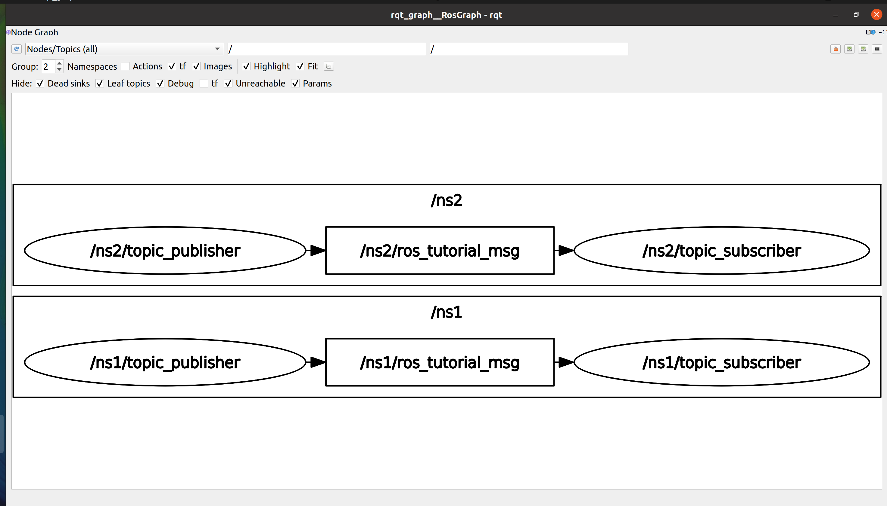

# **Ubuntu install of ROS Noetic**

> NOTE: This instruction focuses on the perfomance installation and running commands. For more detail, you can read pdf book [ROS Robot Programming (35.6 MB)](https://www.robotis.com/service/download.php?no=719) and go to [ROS Official Tutorials](https://wiki.ros.org/ROS/Tutorials).

 

### Previous: [17. Basic ROS Programming #3: Writing and Running the Action Server and Client Node](17-Basic-ROS-Programming-(3)-Writing-and-Running-the-Action-Server-and-Client-Node.md)

 

# 19. Basic ROS Programming #5: Using roslaunch

The ‘rosrun’ is a command that executes just one node, and ‘roslaunch’ can run more than one node. Other features of the ‘roslaunch’ command include the ability to modify parameters of the package, rename the node name, the ROS_ROOT and ROS_PACKAGE_PAPATION_PATH settings, and change environment variables.

The ‘roslaunch’ uses the ‘*.launch’ file to select executable nodes, which is XML-based and provides tag-specific options. The execution command is ‘roslaunch [package name] [roslaunch file]’.

## 1. Using the roslaunch

To learn how to use roslaunch, rename the ‘topic_publisher’ and ‘topic_subscriber’ nodes previously created. There is no point of only changing the names, so let’s run two sets of publisher and subscriber nodes to communicate with each other.

First, write a `‘*.launch’` file. The file used for roslaunch has a `‘*.launch’` extension file name, and you have to create a ‘launch’ folder in the package folder and place the launch file in that folder. Create a folder with the following command and create a new file called ‘union.launch’.

Run commands:

    roscd ros_tutorials_topic
    mkdir launch
    cd launch
    gedit union.launch

Write the contents of the ‘union.launch’ file as follows.

    <launch>
        <node pkg="ros_tutorials_topic" type="topic_publisher" name="topic_publisher1"/>
        <node pkg="ros_tutorials_topic" type="topic_subscriber" name="topic_subscriber1"/>
        <node pkg="ros_tutorials_topic" type="topic_publisher" name="topic_publisher2"/>
        <node pkg="ros_tutorials_topic" type="topic_subscriber" name="topic_subscriber2"/>
    </launch>

The tags required to run the node with the ‘roslaunch’ command are described within the `<launch>` tag. The `<node>` tag describes the node to be executed by ‘roslaunch’. Options include ‘pkg’, ‘type’, and ‘name’.

- **pkg:** Package name

- **type:** Name of the actual node to be executed (Node Name)

- **name:** The name (executable name) to used when the node corresponding to the ‘type’ above is executed. The name is generally set to be the same as the type, but it can be set to use a different name when executed.

Once the ‘roslaunch’ file is created, run ‘union.launch’ as follows. Note that when the ‘roslaunch’ command runs several nodes, the output (info, error, etc.) of the executed nodes is not displayed on the terminal screen, making it difficult to debug. If you add the ‘--screen’ option, the output of all nodes running on that terminal will be displayed on the terminal screen.

Run:

    roslaunch ros_tutorials_topic union.launch --screen

What would the screen look like if we run it? First, let’s take a look at the nodes currently running with the following command.

Open another terminal and run:

    rosnode list

Output:

    /rosout
    /topic_publisher1
    /topic_publisher2
    /topic_subscriber1
    /topic_subscriber2

As a result, the ‘topic_publisher’ node is renamed and executed as ‘topic_publisher1’ and ‘topic_publisher2’. The ‘topic_subscriber’ node is also renamed and executed as ‘topic_subscriber1’ and ‘topic_subscriber2’.

The problem is that unlike the initial intention to “run two publisher nodes and two subscriber nodes and make them communicate with their corresponding pairs”, we can see through ‘rqt_graph’ as below figure that each subscriber is receiving a topic from both publishers. This is because we simply changed the name of the node to be executed without changing the name of the message to be used. Let’s fix this problem with namespace tag in ‘roslaunch’.

Let’s modify the ‘union.launch’ file that we created earlier.

Run commands:

    roscd ros_tutorials_topic/launch
    gedit union.launch

Write the contents of the ‘union.launch’ file as follows.

    <launch>
        <group ns="ns1">
            <node pkg="ros_tutorials_topic" type="topic_publisher" name="topic_publisher"/>
            <node pkg="ros_tutorials_topic" type="topic_subscriber" name="topic_subscriber"/>
        </group>
        <group ns="ns2">
            <node pkg="ros_tutorials_topic" type="topic_publisher" name="topic_publisher"/>
            <node pkg="ros_tutorials_topic" type="topic_subscriber" name="topic_subscriber"/>
        </group>
    </launch>

The tag `<group>` binds specific nodes. The option ‘ns’ refers to the name of the group as a namespace, and the name and message of the node belonging to the group are both included in the name specified by ‘ns’.

Once again, visualize the status of the connection and message transmission between nodes using ‘rqt_graph’. This time, we can see that each node is communicating its intended pair as shown in below figure.

Open a new terminal and run:

    cd catkin_ws && catkin_make
    roslaunch ros_tutorials_topic union.launch --screen

Open a another terminal and run:

    rqt_graph

## 2. Launch Tag

The Launch tag can be applied in a variety of ways depending on the XML that is written in the launch file. The tags used in Launch are as follows.

- **`<launch>`** The beginning and end of the roslaunch syntax.

- **`<node>`** Tag for node execution. The package, node name, and execution name can be
changed.

- **`<machine>`** The name, address, ros-root, and ros-package-path of the system running the node can be set.

- **`<include>`** Additional launch file can be included from current/other packages to be launched together.

- **`<remap>`** ROS variables such as node name and topic name used in the node can be replaced with other name.

- **`<env>`** Set environment variables such as path and IP (rarely used).

- **`<param>`** Set the parameter name, type, value, etc.

- **`<rosparam>`** Check and modify parameter information such as load, dump, and delete like the ‘rosparam’ command.

- **`<group>`** Group executable nodes.

- **`<test>`** Used to test nodes. Similar to `<node>`, but with options available for testing purposes.

- **`<arg>`** Define a variable in the launch file so that the parameter is changed when executed as shown below.

Internal parameters can be changed from the outside when executing a launch file with `<param>` and `<arg>` tags, which is a variable in the launch file. Familiarize yourself with this parameter as it is a very useful and widely used method.

For example:

    <launch>
    <arg name="update_period" default="10" />
    <param name="timing" value="$(arg update_period)"/>
    </launch>

 

    roslaunch my_package my_package.launch update_period:=30

