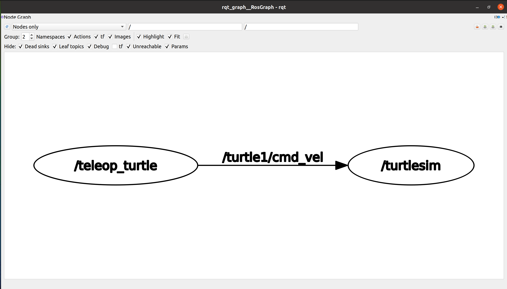

# **Ubuntu install of ROS Noetic**

> NOTE: This instruction focuses on the perfomance installation and running commands. For more detail, you can read pdf book [ROS Robot Programming (35.6 MB)](https://www.robotis.com/service/download.php?no=719) and go to [ROS Official Tutorials](https://wiki.ros.org/ROS/Tutorials).

 

### Previous: [5. Building a ROS Package](5_Building_a_ROS_Package.md)

 

# 6. ROS Operation Test

## 6.1 Configuring the ROS Network

This is the configuration for ROS_MASTER_URI and ROS_HOSTNAME. ROS uses a network to
communicate messages between nodes, so **the network configuration is very important**. First,
we will use our own IP address to both fields. **`Later on if there are master PC and the robot uses
a host PC, network has to be configured on both PCs in order to allow multiple computers to
communicate each other`**. For now we will enter our own network IP to both fields as we are using only one PC. The following example shows the case of how to configure if your IP address
is ‘192.168.1.100’. You can [check your IP](https://linuxconfig.org/how-to-find-my-ip-address-on-ubuntu-20-04-focal-fossa-linux) information in the terminal window with 'ip a'
command. 

    # Set ROS Network
    export ROS_HOSTNAME=192.168.1.100
    export ROS_MASTER_URI=http://${ROS_HOSTNAME}:11311

If you are running all packages on one PC, there is no need to assign a specific IP, but instead
assign ‘localhost’ for both fields.

    # Set ROS Network
    export ROS_HOSTNAME=localhost
    export ROS_MASTER_URI=http://localhost:11311

## 6.2 ROS Operation Test

Now that we have installed ROS, let’s test if it works correctly. The following example is the
turtlesim package (bundle of nodes) provided by ROS to display the turtle on the screen and
control the turtle with the keyboard node (program).

In this section, we will
verify that ROS has been installed without any problems.

### 6.2.1 Running roscore

Open a new terminal window (Ctrl + Alt + t) and run the following command. This will run
roscore, which will have control over the whole ROS system.

    roscore

Screen showing roscore running:

### 6.2.2 Running turtlesim_node in the turtlesim package

**Open a new terminal window** and enter the following command. Then you will see appended
messages, and turtlesim_node in the turtlesim package will be executed. In the middle of blue
window, you will see a turtle.

    rosrun turtlesim turtlesim_node

Output:

    [ INFO] [1633809534.409404294]: Starting turtlesim with node name /turtlesim
    [ INFO] [1633809534.413970894]: Spawning turtle [turtle1] at x=[5,544445], y=[5,544445], theta=[0,000000]

Screen showing the turtle at initial state:

### 6.2.3 Running turtle_teleop_key in the turtlesim package

**Open a new terminal window** and enter the following command. Then you will see appended
messages and instructions, and turtle_teleop_key of the turtlesim package will be executed. ***If
any of arrow keys on the keyboard (←, → , ↑, ↓) is pressed in this terminal window, the turtle
will move according to the arrow key*.** You must enter
the key in the corresponding terminal window. Although this is only a simple simulation, we
will be able to control an actual robot with the same method.

    rosrun turtlesim turtle_teleop_key

Output:

    Reading from keyboard
    ---------------------------
    Use arrow keys to move the turtle. 'q' to quit.

Screen showing the turtle being moved:

### 6.2.4 Running rqt_graph in the rqt_graph package

Entering the rqt_graph command **in a new terminal window** will run the rqt_graph node in the
rqt_graph package. The result is shown as a diagram of the information of currently running
nodes (programs).

    rqt_graph

The rqt_graph node shows information about the currently running nodes in a GUI form. A
circle represents a node and a square represents a topic. If we look at following Figure, an arrow is
drawn from the ‘/teleop_turtle’ node that connects to ‘/turtlesim’. This demonstrates that the two
nodes are running, and there is message communication taking place between these two nodes.

The text on arrow ‘/turtle1/cmd_vel’, which is a sub-topic of the turtle1 topic, located in between
two arrows is the topic name for two nodes, and visualizes that the speed command entered
with the keyboard in the teleop_turtle node is being sent to the turtlesim node as a message in
the topic.

That is to say, using the above two nodes, keyboard commands were transferred to the robot
simulation. More detailed information will be explained in the following sections, and if you
have followed along well so far, you have completed the ROS operation test.

### 6.2.5 Closing the node

The roscore and each node can be terminated by pressing [Ctrl+c] in the corresponding terminal
windows. For your information, [Ctrl+c] is used to close a program on Linux/Unix forcibly.

 

### Next: [7. Important Concepts of ROS](7_Important_Concepts_of_ROS.md)