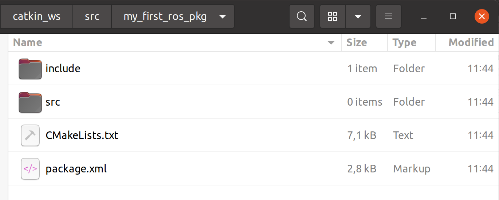

# **Ubuntu install of ROS Noetic**

> NOTE: This instruction focuses on the perfomance installation and running commands. For more detail, you can read pdf book [ROS Robot Programming (35.6 MB)](https://www.robotis.com/service/download.php?no=719) and go to [ROS Official Tutorials](https://wiki.ros.org/ROS/Tutorials).

 

### Previous: [7. Important Concepts of ROS](7_Important_Concepts_of_ROS.md)

 

# 8. Build System (1): Create your own ROS package

## 8.1 Creating your own Package

The command to create a ROS package is as follows.

    catkin_create_pkg [PACKAGE_NAME] [DEPENDENT_PACKAGE_1] [DEPENDENT_PACKAGE_N]

‘catkin_create_pkg’ command creates a package folder that contains the ‘CMakeLists.txt’ and
‘package.xml’ files necessary for the Cake build system. Let’s create a simple package to help you
understand. First, open a new terminal window (Ctrl + Alt + t) and run the following command
to move to the workspace folder.

    cd ~/catkin_ws/src

The package name to be created is ‘my_first_ros_pkg’. Package names in ROS should all be
lowercase and must not contain spaces. The naming guideline also uses an underscore (_)
between each word instead of a dash (-) or a space. See the relevant pages for coding style guide and naming conventions in ROS. Now, let’s create a package named ‘my_first_ros_pkg’ with
the following command:

    catkin_create_pkg my_first_ros_pkg std_msgs roscpp

Output:

    Created file my_first_ros_pkg/package.xml
    Created file my_first_ros_pkg/CMakeLists.txt
    Created folder my_first_ros_pkg/include/my_first_ros_pkg
    Created folder my_first_ros_pkg/src
    Successfully created files in <path to catkin workspace>/catkin_ws/src/my_first_ros_pkg. Please adjust the values in package.xml.

‘std_msgs’ and ‘roscpp’ were added as optional dependent packages in the previous
command. This means that the ‘std_msgs’, which is a standard message package of ROS, and the
‘roscpp’, which is a client library necessary to use C/C++ in ROS, must be installed prior to the creation of the package. These dependent package settings can be specified when creating the
package, but can also be created directly in ‘package.xml’.

Once the package is created, ‘my_first_ros_pkg’ package folder will be created in the ‘~/
catkin_ws/src’ folder, along with the default internal folder that the ROS package should have,
and the ‘CMakeLists.txt’ and ‘package.xml’ files. The contents can be checked with the ‘ls’
command as below, and the inside of the package can be checked using the GUI-based tool
Nautilus which acts like Window Explorer.

    cd my_first_ros_pkg
    ls

Output:

    CMakeLists.txt  include  package.xml  src

include --> Include Folder

src --> Source Code Folder

CMakeLists.txt --> Build Configuration File

package.xml --> Package Configuration File

## 8.2 Modifying the Package Configuration File (package.xml)

‘Package.xml’, which is one of the essential ROS configuration files, is an XML file containing
information about the package, including the package name, author, license, and dependent
packages. The original file without any modifications is shown below.

    <package format="2">
        <name>my_first_ros_pkg</name>
        <version>0.0.0</version>
        <description>The my_first_ros_pkg package</description>
        <!--  One maintainer tag required, multiple allowed, one person per tag  -->
        <!--  Example:   -->
        <!--  <maintainer email="jane.doe@example.com">Jane Doe</maintainer>  -->
        <maintainer email="<user name>@todo.todo"><user name></maintainer>
        <!--  One license tag required, multiple allowed, one license per tag  -->
        <!--  Commonly used license strings:  -->
        <!--    BSD, MIT, Boost Software License, GPLv2, GPLv3, LGPLv2.1, LGPLv3  -->
        <license>TODO</license>
        <!--  Url tags are optional, but multiple are allowed, one per tag  -->
        <!--  Optional attribute type can be: website, bugtracker, or repository  -->
        <!--  Example:  -->
        <!--  <url type="website">http://wiki.ros.org/my_first_ros_pkg</url>  -->
        <!--  Author tags are optional, multiple are allowed, one per tag  -->
        <!--  Authors do not have to be maintainers, but could be  -->
        <!--  Example:  -->
        <!--  <author email="jane.doe@example.com">Jane Doe</author>  -->
        <!--  The *depend tags are used to specify dependencies  -->
        <!--  Dependencies can be catkin packages or system dependencies  -->
        <!--  Examples:  -->
        <!--  Use depend as a shortcut for packages that are both build and exec dependencies  -->
        <!--    <depend>roscpp</depend>  -->
        <!--    Note that this is equivalent to the following:  -->
        <!--    <build_depend>roscpp</build_depend>  -->
        <!--    <exec_depend>roscpp</exec_depend>  -->
        <!--  Use build_depend for packages you need at compile time:  -->
        <!--    <build_depend>message_generation</build_depend>  -->
        <!--  Use build_export_depend for packages you need in order to build against this package:  -->
        <!--    <build_export_depend>message_generation</build_export_depend>  -->
        <!--  Use buildtool_depend for build tool packages:  -->
        <!--    <buildtool_depend>catkin</buildtool_depend>  -->
        <!--  Use exec_depend for packages you need at runtime:  -->
        <!--    <exec_depend>message_runtime</exec_depend>  -->
        <!--  Use test_depend for packages you need only for testing:  -->
        <!--    <test_depend>gtest</test_depend>  -->
        <!--  Use doc_depend for packages you need only for building documentation:  -->
        <!--    <doc_depend>doxygen</doc_depend>  -->
        <buildtool_depend>catkin</buildtool_depend>
        <build_depend>roscpp</build_depend>
        <build_depend>std_msgs</build_depend>
        <build_export_depend>roscpp</build_export_depend>
        <build_export_depend>std_msgs</build_export_depend>
        <exec_depend>roscpp</exec_depend>
        <exec_depend>std_msgs</exec_depend>
        <!--  The export tag contains other, unspecified, tags  -->
        <export>
        <!--  Other tools can request additional information be placed here  -->
        </export>
    </package>

