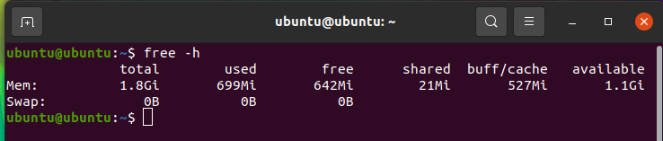
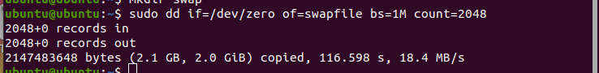

# Installing permanent virtual memory on the Ubuntu OS for Raspberry pi 4B

For some reasons, your Raspberry Pi is not enough RAM (Random Access Memory) or you want to have more RAM but don't want to change RAM bar. This article is for you.

## 1. First look at the virtual memory in the system

Use the following command to check the swap partition size in the system.

    free -h

If virtual memory is not installed, 0 is displayed.

If it is installed, amount of memory will be displayed.

## 2. Create swap virtual memory directory

Run commands:

    mkdir swap
    cd swap
    #Here, 1M * 1024 = 1GB of swap memory 
    sudo dd if=/dev/zero of=swapfile bs=1M count=1024

I want to have 2GB of virtual memory, then my variable "count" is set equal to 2048.

## 3. Convert the generated file into virtual memory

Continuously run command:

    sudo mkswap swapfile

## 4. Activate virtual memory

Continuously run command:

    sudo swapon swapfile

## 5. Check again

Run command:

    free -h

So far, the virtual memory has taken effect, but this virtual memory is only for this startup. After the restart, the virtual memory will still fail.
But the memory file is still there. You just need to mount it manually.

**If you don’t want to mount virtual memory manually after every reboot, let’s continue!**

## 6. Permanent Virtual RAM

If you want this virtual memory (SWAP) to work all the time, we can add it to the startup configuration.

Run command:

    sudo vi /etc/fstab

Press i to change to insert mode.

Navigate to the last line and write: **`/home/ubuntu/swap/swapfile swap swap defaults 0 0`**

Press `Esc` key, type ":w" and hit `Enter` key.

Quit vi by pressing `Esc` key, type ":x" and hit `Enter` key.

You will come back to command interface.

Okay, now, virtual memory will mount automatically after every system restart.

## 7. Unactivate Virtual RAM

If you don’t want to use it, the way to unactivate the virtual memory is as follows: 

    cd swap
    sudo swapoff swapfile

It still be mounted each time you start your Ubuntu due to startup configuration. 

## 8. Delete Virtual RAM

If you **really don't need Virtual RAM anymore**, you can delete it by removing folder "swap" (and in Trash folder as well).

